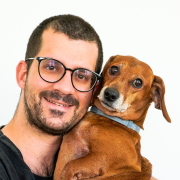
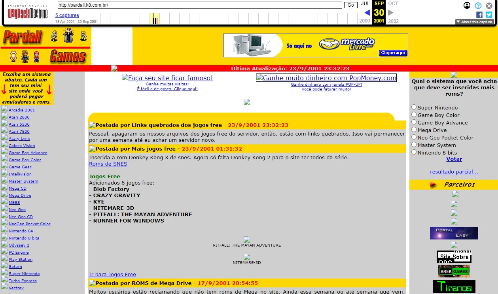

%{
	summary: "Alfred Reinold Baudisch (Pardall): savant, polymath, software engineer and database architect with 26 years of development experience, obsessed by Art and Dachshund dogs. See more about the author and what powers this website.",
	thumbnail: "/_resources/9002684aee164899a463ea7926b41286.jpg",
	date: "2021-09-20"
}
---

**Alfred Reinold Baudisch** Software engineer and database architect with 26 years of development experience, specialized in real-time systems and APIs, currently working with **Elixir, Phoenix and Phoenix LiveView**. From 🇧🇷, living in Copenhagen 🇩🇰.

[Savant](https://en.wikipedia.org/wiki/Savant_syndrome) (diagnosed), [polymath](https://en.wikipedia.org/wiki/Polymath) and hyper-learner, currently mostly focused on learning (and practicing) art in general. But my focus change constantly.

> **A polymath**, ("having learned much", "universal person") is an individual whose knowledge spans a substantial number of subjects, known to draw on complex bodies of knowledge to solve specific problems.
>
> **Savant syndrome** is a rare condition in which someone who generally has a neurodevelopmental disorder such as autism spectrum disorder demonstrates certain abilities far in excess of average. The skills that savants excel at are generally related to memory.

## More about me

Jack of all trades, autistic savant, hyper-learner, master of learning techniques, master of software engineering and database architecture, with more than 26 of software development experience (I started when I was 8 years old).

I have worked on hundreds of software development projects, using many different languages and frameworks. 

**My biggest passion in life is to learn new things and abilities** and to experiment with them, **creating all kinds of projects projects, especially projects related to Coding, Art, and Games**. This is clearly shown by the number of projects and single pieces of work that I have created in the past two decades.

My main focus of interest, in terms of hobby:
- Art (history of art, digital art, master painters and masterpieces, spending hours at museums, spending days reading art books and also doing art myself).
- Dachshund Dogs.

## Links
- [Email](https://alfredbaudisch.com/contact/)
- [GitHub](https://github.com/alfredbaudisch)
- [Twitter](https://twitter.com/alfredbaudisch)
- [LinkedIn](https://www.linkedin.com/in/alfred-reinold-baudisch-6b1a731a/)
- [More social networks](https://alfredbaudisch.com/contact/)

## Pardall?
Pardall is my childhood nickname, given by my daddy. He would never call me by name, only by "Pardall".

- In [Portuguese](https://en.wiktionary.org/wiki/pardal#Portuguese), "pardal" means "sparrow" (the bird).
- In [English](https://en.wiktionary.org/wiki/pardal#English), "A pard; a panther or leopard".

All definitions fit me, since I'm always finding new toys and ideas around (like a bird), and I'm also fast as a leopard (in terms of learning... but also in changing my mind, all the time).

The reason that my daddy called Pardall was because:
- From [Gyro Gearloose](https://en.wikipedia.org/wiki/Gyro_Gearloose), which in Brazil is called "Professor Pardal" (with a single "l"), because **since I was a kid, I thinkered with everything around, I read all the time (I still do) and I would learn everything by myself** - I taught myself programming at the age of 8 years old.
- And because he said my head had the smell of a sparrow bird.

### Old "Pardall" creations
My first creations were all named *"Pardall[Something]"*. I had websites, softwares, paintings, all named prepended by "Pardall". And then when I reached adulthood I haven't used the name in my projects anymore... until now.

My website PardallGames from 1998. See the [Twitter thread](https://twitter.com/AlfredBaudisch/status/1430931656425320449) where I show the website evolution and how it turned out to be a big website in Brazil.

## This Website
For now, my main website is still [alfredbaudisch.com](https://alfredbaudisch.com/). You can find my projects and a more detailed about there.

I want this website to be a Wiki from all my personal researches and studies. I always studied a lot, creating a lot of clippings and studies, but everything always end up in private, in my Joplin notes. So this website is an experiment to make some of those notes public and shared with the world.

This website is also a proof of concept for my framework [PardallMarkdown](https://github.com/alfredbaudisch/pardall_markdown).

### Powered by
- [Elixir](https://elixir-lang.org/), [Phoenix Framework](https://phoenixframework.org/) and [Phoenix LiveView](https://hexdocs.pm/phoenix_live_view/Phoenix.LiveView.html)
- [PardallMarkdown](https://github.com/alfredbaudisch/pardall_markdown)
	- My own framework: a reactive publishing framework, filesystem-based with support for Markdown, nested hierarchies, and instant content rebuilding.
- Content is created in [Joplin](https://joplinapp.org/), then exported as Markdown to a folder in my computer. The folder is then synced automatically to the server using [SyncThings](https://syncthing.net/) and then PardallMarkdown immediatelly publish the changes to the website. Magic.
- You can build the same website, check the [demo repository](https://github.com/alfredbaudisch/pardall-markdown-phoenix-demo).
- The template is a basic [Bootstrap](https://getbootstrap.com/) template, I didn't want to spend a lot of time with HTML and CSS (maybe one day I'll create a better template).

### Why the .xyz TLD?
I love the TLD `.xyz`. And it's the perfect choice for a site that is named after my nickname "Pardall". 

- XYZ because I shoot at all directions in terms of projects and for what I learn, sometimes in a single direction, sometimes in another, sometimes all of them at once, and that I can quickly learn and make anything I want, due to my savantism.
- XYZ because I change direction and focus (almost) all the time.
- XYZ because it means it points to all the 3 [coordinates of the Cartesian system](https://en.wikipedia.org/wiki/Cartesian_coordinate_system): X, Y and Z, which is related to the 2 first points.
