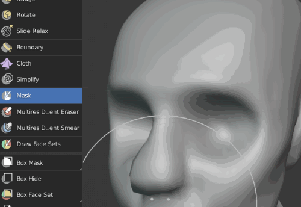
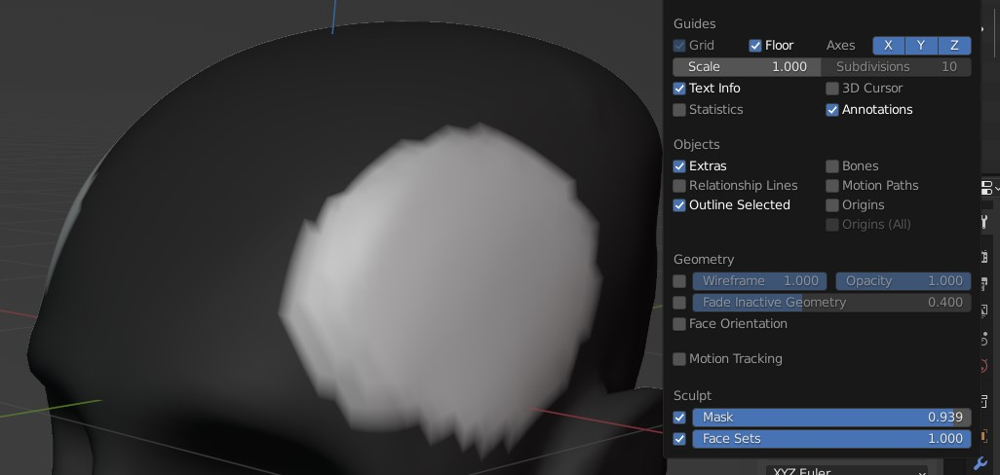

%{
	thumbnail: "/_resources/blender-sculpt-mask-brush-not-working.gif"
}
---

## The problem

Are you trying to sculpt in Blender but none of the brushes seem to be working? Are you using the Mask Tool in Blender sculpting, but the masked area does not appear, like that it's invisible, but then when you try to use the other brushes, they act like the mask is currently active?

I recently went through this and it was very frustrating, as I couldn't figure out why all brushes suddenly stopped working and why masking was also not working or was invisible.

For example, even although masking seemed to be not working, if I tried sculpting anywhere, it wouldn't work, but then other areas would be affected as if a mask was active:

## The solution
Turns out there's a setting for setting up the masked area opacity as well toggling the mask visibility. Go to Show Overlays and mark "Show Mask". Also, adjust the opacity of the mask there.

Problem solved!

