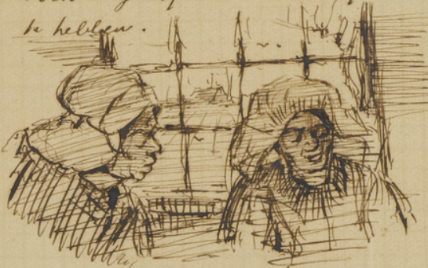

%{
	position: 1,
	summary: "With The Potato Eaters, Van Gogh's first major work, he wanted to depict peasants as they really were. In this article, let's explore his journey while creating this masterpiece: from the first studies, to the idea until completion and shipment of the painting.",
	thumbnail: "/_resources/7c15132cfe818f6bd160a026cd21a9c6.png"
}
---

The Potato Eaters by Van Gogh, painted in Nuenen (The Netherlands).

# Introduction
For The Potato Eaters, **Van Gogh's first major work**, he wanted to depict peasants as they really were. He thus chose **coarse and ugly models**, so they would **look as natural as possible** in the final work. [[source](https://www.wikiart.org/en/vincent-van-gogh/the-potato-eaters-1885-1)]

Van Gogh chose a composition which would challenge his growing prowess as a painter. Like the French master Jean-François Millet, Van Gogh wanted to be **a true "peasant painter"**. [[source](https://artsandculture.google.com/asset/the-potato-eaters/7gFcKarE9QeaXw?hl=en-GB)]

The Potato Eaters was a synthesis of countless studies of peasants' heads, of people absorbed in work and handicrafts. He had to paint a whole series of pictures in order to achieve any real closeness with these intractable people, and his approach resulted in a final triumph. [[source](https://www.vincentvangogh.org/potato-eaters.jsp)]

The painting had to **depict the harsh reality of country life**, so he gave the peasants **coarse faces and bony, working hands**. He strove to paint **the faces, "*the color of a good, dusty potato, unpeeled naturally*"**. He wanted to show in this way that they ***"have tilled the earth themselves with these hands they are putting in the dish ... that they have thus honestly earned their food"***. The message of the painting was more important to Van Gogh than correct anatomy or technical perfection. He was very pleased with the result. [[source](https://www.vangoghmuseum.nl/en/collection/s0005v1962)]

Upon completion of "The Potato Eaters," Van Gogh thought it was his best work to date. And, as far as two years after Van Gogh completed this painting, **he still considered it his finest work**.

This is Vincent's only group portrait painting.

The studies and the paintings were all created while he was in **Neunen**, The Netherlands.

## Formatting

- Numbers (ex: 193) refer to the letter number where the accompanying content/information was extracted from.
- I also added his age at the time of the writing of each letter alongside each letter number, in order to understand better how he progressed during his journey.
- Date format: DD/MM/YY.
    - In most cases I did not write the full number of the years (ex: 1880). But be aware that they obviously refer to the century of 1800's (ex: 07/09/74 refers to 07/September/1874).

# Timeline highlights
One month of head studies, before considering The Potato Eaters painting itself. Then, one month between the plan (06/04/85) of making The Potato Eaters to shipping the finished painting (06/05/85).

In total, two months of preparations and one whole month of work in the painting (April 1885 - May 1885).

- **02/03/85, 31yrs (484)**: Peasant head studies
- **Between 09/03/85-23/03/85 (485)**: More studies, head and hand details perception
- **04/04/85, 32yrs (489)**: Head studies
- **06/04/85 (490)**: First specific mention of the plan to paint The Potato Eaters
- **09/04/85 (492)**: First sketch shared of the composition
- **13/04/85 (493)**: Detailed sketch of the composition
- **18/04/85 (494)**: Litography made, considering making a final painting
- **28/04/85 (496)**: Re-started the painting in a new canvas
- **02/05/85 (499)**: Finished the heads, re-painted the heads skin tones
- **05/05/85 (500)**: Finished the painting
- **06/05/85 (501)**: Painting shipped to Theo

# Detailed timeline with letters and images

## 484 (02/03/85), 31yrs, Beginning of studies for The Potato Eaters?
http://vangoghletters.org/vg/letters/let484/letter.html

>  Recently, [...] I’ve painted heads almost exclusively. And they are studies in the true meaning of the word — that is, they’re meant for the studio.
>  
> this very day I’ve started to make some that I’ll send you (sent in letter 489?)
> 
> I think it possible that it might be of use [...]  albeit only studies
> 
> So you’ll receive heads of an old and a young woman, and probably more than one of these two models. Given what you write of your feelings about various conceptions of heads, I think that these, which come straight out of a cottage with a moss-grown thatched roof, won’t appear to you to be absolutely inappropriate, although they’re studies and nothing else. 
> 
> I’m not the sort of character who has much chance of getting on a sufficiently intimate footing with girls of that sort that  1r:4 they’re willing to pose. And am possibly also prejudiced against women who wear dresses. And my province is more those who wear jackets and skirts.
>
>  the so-called respectable element among Dutch women isn’t really so very attractive — to paint or to think about. But certain common servant girls, on the other hand, are very Chardinesque.
>  
> I’m painting not just as long as there’s light, but even in the evening by lamplight in the cottages, if I can somehow make things out on my palette, in order to capture if possible something of the singular effects of lighting at night, for instance with a large shadow cast on the wall.

### Rural/Peasant prints from Lhermitte
> Thanks, too, for the splendid woodcut after Lhermitte — one of the few things by him that I know, for I saw only these — a troop of girls in the wheat1 — an old woman in church — and a miner or some such in a little bar, and Harvest by him, and otherwise never anything, and nothing ever as much reflecting his actual manner as these woodcutters.
>
> If Le Monde Illustré prints a composition by him every month — this is part of a series of ‘Rural months’ — it would give me mighty great pleasure to collect this whole series, and I’d really like you to send them every time.
> 
> I never see anything here, and after all I do need to see something really beautiful now and then
> 
> I’ve certainly not seen anything in the last few years as fine as those woodcutters by Lhermitte. How his little figures in that composition are felt and wanted.

See more of Lhermitte: http://vangoghletters.org/vg/letters/let484/letter.html

## 485 (between 09/03/85-23/03/85), 31yrs, Continuing with studies
- One year exclusively devoted to painting
- "a great distance still separates me from making something like that myself"
- Acknowledges how he see details in the heads and hands of peasants
- "I don’t know whether I’ll get it finished, though, because it’s a difficult effect"

> I have a few of the heads I promised you ready, but not completely dry yet ... they were painted in a dark cottage and they are — studies — in the true meaning of the word.
> 
> I want to try it again, and so as soon as they’re completely dry and I can varnish them, I’ll send you a few heads and also a little sketch of a yarn-winder.
> 
> although they’re worth nothing now [studies], may well be later. Not so much in themselves as in conjunction with other studies.
> 
> since I’ve devoted myself almost exclusively to painting for more than a whole year, I dare assert that these have something different from the first painted studies that I sent you.
> 
> when I saw those magnificent woodcutters by Lhermitte recently, then I know very well that a great distance still separates me from making something like that myself.
> 
> as regards my views and manner of searching — that is, always directly from nature or in the poor, smoke-blackened cottage (it is possible that Van Gogh wrote ‘bemoste’ (moss-grown) rather than ‘berookte’ (smoke-blackened)) — seeing his work encourages me, for I see (in details in heads and hands, for instance) how artists like Lhermitte must have studied the peasant figure not only from a fairly great distance but from very close to, not now, while they create and compose with ease  1v:2 and certainty, but before they did that.
> 
> They think I imagine — it isn’t true — I remember
> 
> I can’t yet show a single painting, not even a single drawing yet. But I’m making studies, and precisely because of this I can very well conceive of the possibility that a time will come when I, too, will be able to compose readily.
> 
> it’s difficult to say where study stops and painting begins.
>
> I’m thinking about a couple of larger, more worked-up things, and should I get a clear idea of how to achieve the effects I have in mind — in that case I would still keep the studies in question here, because then I would certainly need them for it.  It is, for example, something like this (sketches below)
> 
> Namely figures against the light from a window.
> 
> I have studies of heads for it, both against the light and facing the light, and I’ve already worked on the whole figure several times, seamstress winding yarn, or peeling potatoes. Full face and in profile. I don’t know whether I’ll get it finished, though, because it’s a difficult effect.

A. Head of a woman; B. Seated woman (both F - / JH 713); C. Two heads of women (F - / JH 714)

Woman winding yarn (F 36 / JH 698), 1885 - Oil on canvas - 40.5 x 31.7 cm, Amsterdam, Van Gogh Museum, Vincent van Gogh Foundation

## 489 (04/04/85), 32yrs, More head studies
http://vangoghletters.org/vg/letters/let489/letter.html

> Life isn’t long for anyone, and the question is just — to do something with it, dying is hard, but living is harder still
>
> The painting went better again today; the first two heads went wrong — today’s is a head of a young girl (F 160 / JH 722), almost a child’s head. As to colour, it’s a contrast of bright red and pale green against the colour of the little face; there’s already a head like it among those you took with you.
> 
> I don’t mind starting a new still life of those honesty heads and dry leaves against blue either,
> this year I’ve painted so much the last few months
> 
> Don’t forget that I’m definitely convinced that a painter of peasant life can do no better than follow the example of Barbizon – dwelling and living right in the midst of what one is painting, for it’s new and different outside every day.
>
> If I work hard day after day, I can have another 20 or so studies for you by then, and moreover another twenty or so to take to Antwerp if you want.
>
> (In the mid-nineteenth century a group of painters worked in the French village of Barbizon in the Forest of Fontainebleau. They are known as the Barbizon School – their intimate scenes and sedate landscapes were usually painted outdoors.)
>
> It has become colder again here. As soon as we have a few fine days, I’ll make something of the churchyard. (At the beginning of June this resulted in The old church tower at Nuenen (‘The peasants’ churchyard’) - painted over another scene and had been preceded by three watercolours [let259](http://vangoghletters.org/vg/letters/let259/letter.html#n-6))

A. Head of a woman; B. Head of a woman (both F - / JH 723)

Head of a woman (F 160 / JH 722), 1885 - Oil on canvas - 43 x 30 cm

Head of a woman (Gordina de Groot) (F 130 / JH 692), 1885 - Oil on canvas - 42.7 x 33.5 cm

Head of a woman (F 69 / JH 724), 1885 - Oil on canvas - 43.8 x 30 cm

Honesty in a vase (F 76 / JH 542), 1885 - Oil on canvas - 42.7 x 31.7 cm

The old church tower at Nuenen (‘The peasants’ churchyard’) (F 84 / JH 772), 1885 - Oil on canvas - 65 x 80 cm

## 490 (06/04/85), 32yrs, First mention of The Potato Eaters
http://vangoghletters.org/vg/letters/let490/letter.html

- Letter with first specific mention of Van Gogh’s plan to paint potato eaters
- "I plan to make a start this week on that thing with the peasants around a dish of potatoes in the evening"

> I just kept painting these two Sundays [...] still very sad (Mr. Van Gogh died) [...]  I’d almost never started a year in a gloomier mood. It’s certain that there’ll be a whole lot more trouble for all of us. [...] It will make things even more difficult for me
>
> Herewith another scratch of a man’s head and one of a still life with honesty (Van Gogh painted Basket of apples over the painting after which the enclosed sketch Honesty in a vase was done) in the same style as the one you took with you. It’s rather larger, though — and the objects in the foreground are a tobacco pouch and a pipe of Pa’s. (The still life with honesty, tobacco pouch and a pipe can be seen on an X-ray of Basket of apples)
> 
> I desire nothing other than to live deep in the country and to paint peasant life. [...]  I feel more at home in the country. [...] I’ll inevitably have to have a cupboard built, for instance, because at present I have nowhere at all to store things, and I’ll also improve the light. To me, moving would be as bad as a fire — and anyway I think that we’ll stay on top of things with perseverance and effort.
> 
> it will still take me a great deal of effort before I imprint my paintings in people’s heads. [...] I have no intention whatsoever of allowing myself to be discouraged. [...] I read about Delacroix — 17 of his paintings were rejected; ‘dix-sept de refusés’, he himself told his friends straight out
> 
> the battle has to be continued even now, and for my part I also want to fight for as much and as little as I’m worth.
> 
> while I toil away on more important compositions, I’m sending you the studies as they come straight from the cottages. Of course people will say they’re not finished or they’re ugly &c. &c., but — in my view — show them anyway. For my part, I have a firm belief that there are a few people who, ending up in and tied to the city, retain indelible impressions of the country, and continue to feel homesick for the fields and the peasants all their lives.
> 
> Art lovers like this are sometimes struck by sincerity, and not put off by what deters others. [...]  little by little we’ll find a few people for it. [...] gradually we’ll also be able to show better things.
>
> I think I’ll start painting in watercolour regularly in the evenings — as soon as I’m living in the studio — it can’t really be done in the living room here at home. Until then, I’ll go on working from the model in the evenings too.
> 
> I plan to make a start this week on that thing with the peasants around a dish of potatoes in the evening, or — perhaps I’ll make daylight of it, or both, or — ‘neither one’ — you’ll say. But should it succeed or should it fail, I’m going to start on the studies for the different figures.

Basket of apples (F 99 / JH 930), 1885 - Oil on canvas - 45 x 60.4 cm, Amsterdam, Van Gogh Museum, Vincent van Gogh Foundation

### Vincent troubles with family
> Anna: "[Vincent’s] disappointments often embittered him and made him not a normal person. That was a difficult thing for my parents, who could not always follow him and often misunderstood him."
>
> Then, Van Gogh: What she said to you changed nothing of what she reproached me for, and however absurd those reproaches were and her unfounded presumptions about things that are still in the future — she hasn’t told me she takes them back. You understand how I simply shrug my shoulders at such things — and anyway, I increasingly let people think of me just exactly what they will, and say and do too, if need be.
> 
> Ma simply cannot comprehend that painting is a faith and that it brings with it the duty to pay no heed to public opinion — and that in it one conquers by perseverance and not by giving in.

## 491 (09/04/85), 32yrs
> I’m making a couple of studies here — of the potato planting — on which I may possibly have to continue to work on the day in question.

Man and woman planting potatoes (F 129a / JH 727), 1885 - Oil on canvas - 33 x 41 cm, Zurich, Kunsthaus

## 492 (09/04/85), 32yrs, Composition sketch
- Talks a lot about art studies and the relation between artists and collectors interested in studies
- Vincent had scribbled a letter sketch to give Theo an initial impression of the painting The potato eaters

> Herewith two scratches after a couple of studies that I made, while at the same time I’m working on those peasants around a dish of potatoes again.
> 
> have worked on it further by lamplight — although this time I started it in daylight.
> 
> this is what the composition has now become. I’ve painted it on a fairly large canvas, and as the sketch is now, I believe there’s life in it
>  
> C.M., for instance, would speak of — badly drawn &c. [...] the beautiful effects of the light in nature require one to work very fast. Now I know very well that the great masters were able both to finish and to maintain the vitality, particularly in the period of their mature experience. [...] I certainly won’t be able to do like that for the time being. [...] At the point where I now am, though, I see a chance of giving a felt impression of what I see. [...] one sees nature through one’s own temperament.
> 
> let me work as much as is in any way possible — and keep all the studies from now on yourself [...] I wouldn’t like to have them circulating like paintings, so that one would have to buy them back later should one make something of a name. [...] some day we’ll find someone who wants to do what I’m suggesting to you, that is, make a collection of studies.
>
> [...] isn’t an art lover better off when he has, say, 20 very diverse sketches by a painter for the same price that he would reasonably have to pay for one painting that was finished so that it could be put into circulation as a saleable commodity? [...] I’d just try once to put painted studies on the market proper — not as paintings, but mounted somehow or other, on gilt Bristol, say, or black or dark red.
> 
> I mean to go out regularly in the mornings and just tackle whatever I see the people doing in the fields or at home. As I do now anyway.
> 
> Not all painters make a lot of studies — but many do, and the young ones in particular have to do it as much as possible, don’t they? Anyone who owns a painter’s studies can be as good as certain (at least so it seems to me) that there’s a bond between the painter and him that can’t easily be broken just on a whim.
> 
> There are people, aren’t there, who support painters during the time when they aren’t yet earning — very well. [...] But how often does it happen that such a thing ends badly — unpleasantly for both parties? On the one hand because the patron is dissatisfied about money that’s wholly wasted, or at least seems to be. On the other hand because the painter feels entitled to ask for more trust, more patience and interest than people are prepared to give. 
> 
> I hope that gradually my studies will give you some new courage. [...] fortune favours the bold [...] one must work and be bold if one really wants to live. [...]  let’s paint a lot and be productive, and be ourselves with faults and qualities — I say us — because the money from you that I know causes you trouble enough to provide for me, gives you the right, if anything good happens in my work, to consider half of it as your own creation.

Study: The potato eaters (F 78 / JH 734), 1885 - Oil on canvas on panel - 73.9 x 95.2 cm

## 493 (13/04/85), 32yrs, Detailed sketch of the composition
http://vangoghletters.org/vg/letters/let493/letter.html

- Sends a more detailed sketch of the Potato Eaters
- Ponders about simple life around the peasants, living like the peasants, "'it’s a question of going around in clogs', that is of being content as regards food, drink, clothes, sleep, with what the peasants are content with.", "in art one must give heart and soul"
- "neither count on nor wish for general approbation or appreciation"

> enclose herewith a scratch, more precise than the one before, after my latest study. [...]  this is very much in haste and serves only to give you a clearer idea of effect and composition than the first.
> 
> I haven’t been able to work it up as far as had been my intention. I painted 3 days continuously from early till late, and by Saturday evening the paint started to get into a state that didn’t allow further work. Unless it’s completely dry first
> 
> this is to be the first in a series of lithographs, which I’m planning to start again. [...]  I’m also planning to make a lithograph of this thing myself. That lithograph won’t be published anyway, but is entirely private. By the way, I don’t really mind if they don’t want it — because I’ll certainly lithograph myself what I want to lithograph.
> 
> I’m now getting use of the stone — graining,3 paper and printing of 50 copies for 3 guilders. I’m thinking of making a series of subjects from peasant life, in short — the peasants at home.
> 
> the heaths and the villages here are still very beautiful, and just being here I see in it an inexhaustible resource for subjects from peasant life — and the question is just — to seize it — to work. I have a great desire to start making watercolours and drawings again, too — and when I’m living in my studio I’ll make time for it in the evenings.
> 
> I just think about what Millet said: ‘I would never do away with suffering, for it is often that which makes artists express themselves most vigorously’.
> 
> When I say that I’m a peasant painter, that is really so, and will become clearer to you in future; I feel at home there. And it’s not for nothing that I’ve spent so many evenings sitting pondering by the fire with the miners and the peat-cutters and the weavers and peasants here — unless I had no time to think — because of the work. I’ve become so absorbed in peasant life by continually seeing it at all hours of the day that I really hardly ever think of anything else.  
> 
> the public mood — that is, indifference — to Millet’s work — as you just had the opportunity to see at that exhibition — isn’t encouraging, either for the artists or for those who have to sell paintings. I agree — but Millet himself felt and knew that — and, on reading Sensier, what he said about the start of his career struck me so much that although I don’t remember it literally, I remember the sense of it, that is, ‘that (i.e. that indifference) would be bad enough for me if I needed fine shoes and the life of a gentleman — but — because I go around in clogs, I shall manage’. And that’s how it turned out.
> 
>  ‘it’s a question of going around in clogs’, that is of being content as regards food, drink, clothes, sleep, with what the peasants are content with.
>  
> That’s what Millet did — and — didn’t want anything else anyway — and in my view this means that as a human being he has shown painters a way that Israëls and Mauve, say, who live quite luxuriously, do not show, and I say again — Millet is — PÈRE Millet, that is, counsellor and guide in everything, for the younger painters [...]  I think the same, and entirely believe what he says.
> 
> isn’t it precisely because the painters are so often not deeply enough involved personally in peasant life? Millet said on another occasion — in art one must give heart and soul
> 
> Degroux is one of the good Milletesque masters. 
> 
> anyone who really wants to accomplish something good or useful should neither count on nor wish for general approbation or appreciation, but on the contrary should expect nothing other than that only a very few hearts — and even then only maybe — will sympathize and join in.
> 
> things are all right with Ma and the sisters — nevertheless I see and feel it’s so much for the better — for living together would become insupportable in the long run.

## 494 (18/04/85), 32yrs, Litography made, considering making a final painting
http://vangoghletters.org/vg/letters/let494/letter.html

- Considering making the composition a final painting: "If I work the sketch up into a painting"
- Contains a passage about color that Van Gogh amended to Theo from Charles Blanc, Les artistes de mon temps

> ‘the ancients didn’t start from the line but from the centres’; that is, beginning with the circular or elliptical bases of the masses instead of the outline.
> 
> It seems to me that the more what one does is felt and has life, the more it’s criticized and gives offence, but at the same time it overcomes the criticism in the long run.
>
> I know that they do exist, these certainly rather rare people who have collier’s faith and aren’t moved hither and thither by public opinion.
> 
> That he detected personality in it [the composition] pleases me very much indeed, and anyway I’m also trying more and more to be myself, remaining relatively indifferent as to whether people think it very ugly or better. 
> 
> You’ll receive a couple of copies of a lithograph by this post. (The lithograph The potato eaters (F 1661 / JH 737 [2135]). Ill. 2135 [2135]. Later Van Gogh says he did this ‘entirely from memory and in 1 day’ (letter 516)) [...] I want to learn to make lithographs myself so as to be independent.
> 
> I’d like to work up the sketch I painted in the cottage, with a few changes, into a definitive form of painting. [...] At least it’s a thing that I’ve felt, and one such that I would be able to point to defects and certain errors in it myself, just as well as other critics. [...] there’s a certain life in it, and perhaps more than in certain paintings in which there are no errors at all.
> 
> If I work the sketch up into a painting, I’ll also make a new lithograph of it, and such that the figures — which are now reversed, I’m sorry to say — come right again.

The potato eaters (F 1661 / JH 737), 1885 - Lithography, drawn on the stone with lithographic crayon and brush and black ink, scratched - 28.4 x 34.1 cm

"the sketch I painted in the cottage": Study: The potato eaters (F 78 / JH 734), 1885 - Oil on canvas on panel - 73.9 x 95.2 cm

## 495 (21/04/85), 32yrs
- "I hope that the painting of those potato eaters will progress a bit."
- "a certain hesitancy, a certain narrow-mindedness [...] when people conceive of realism in the sense of literal truth"

> There’s a school — I believe — of — Impressionists. But I don’t know much about it. (Van Gogh remained ignorant of Impressionism for a long time)
> 
> there are rules or principles or basic values for both drawing and colour — which one — proves to arrive at — when one finds something true.
> 
> As regards drawing — for instance, that question of drawing figures from the circle — that is, based on the fundamental oval planes, which the ancient Greeks already felt and which will continue to be until the end of the world.
>
> What is a broken tone? What is a neutral tone?4 Which one can point out better on the palette than put into words
> 
> the painting I’m working on5 is different from lamplights by [[Gerard] Dou](https://www.rijksmuseum.nl/en/collection/SK-A-87) or Van Schendel — it’s perhaps not superfluous to point out how one of the most beautiful things by the painters of this century has been the painting of darkness that is still colour [...] that it — is about SOMETHING. And that something is a question that just came into my mind when I was painting.
> 
> I hope that the painting of those potato eaters will progress a bit. Besides that, am also working on a red sunset. To paint peasant life one has to be master of such an enormous number of things.
> 
> I know of nothing that one works on with such peace, in the sense of peace of mind, even when one has a great struggle in material things.
> 
> Moving is causing me some considerable concern these days, because it’s never straightforward.
> 
> How rightly it was said of Millet’s figures — his peasant seems to be painted with the soil he sows! How accurate and true that is. And how much it comes down to knowing how to make on the palette those colours that one cannot name and of which everything — fundamentally — actually consists. Perhaps — I dare say certainly — the questions of colours, and specifically broken — and — neutral — colours, will preoccupy you once more.
> 
> I saw [...] a decidedly clever, realistic study of the head of an old woman by someone who’s directly or indirectly a pupil of the Hague School. But both in drawing and in colour a certain hesitancy, a certain narrow-mindedness, much more [...]. And this phenomenon is threatening to become more and more general. When people conceive of realism in the sense of literal truth — namely precise drawing and local colour. 

Landscape with sunset (F 191 / JH 762), 1885 - Oil on canvas on cardboard - 35 x 43 cm

## 496 (28/04/85), 32yrs, Hard at work, started again

- "I’ve started it again on a new canvas": probably refers from moving on from the previously shown "the sketch I painted in the cottage" to the final known "The Potato Eaters"
- Insight about studies: "where no creative process may take place, but where one obtains food for one’s imagination from reality so that it becomes right"

> I’m hard at work on the potato eaters.
> 
> I’ve started it again on a new canvas and painted new studies of the heads; changed the hands, in particular, a great deal. Above all, I’m doing my best to put life into it. (Delacroix: ‘He wanted life; life at all costs, life everywhere, in the fields, in the skies, around his figures’)
> 
> The Lhermittes are superb. I adore them
> 
> I won’t send the potato eaters unless I know for sure that it’s something. [...]  it’s coming along, and I think there’ll be something very different in it from what you can ever have seen by me. At least that clearly
> 
> I mean the life especially. I’m painting this from memory on the painting itself. But you know yourself how many times I’ve painted the heads!
> 
> I keep going and looking every evening, to redraw sections on the spot.
>  
> But in the painting I let my own head, in the sense of idea or imagination, work, which isn’t so much the case with studies, where no creative process may take place, but where one obtains food for one’s imagination from reality so that it becomes right.
> 
> up till now I’ve made nothing but studies — but — the paintings will come. And I’ll stick to that
> 
> I’ve derived a great deal from something Delacroix said (Charles Blanc’s Grammaire des arts du dessin and in Les artistes de mon temps). The first was his theory of colour, but I also read a conversation that he had with other painters about the making, that is the creation, of a painting. He asserted that one made the best paintings — from memory. By heart! he said.
> 
> I shan’t send it unless I hear further from you, and anyway it’s not even finished yet. But the most difficult things, the heads, hands and ensemble, are.
> 
> although personal, it will nonetheless remind you of other painters with a certain family likeness. Which you didn’t find in the studies then, but I suggest that if one compared my studies with other studies, there would also be a resemblance.
> 
> Henri Pille. "Do not start from the line but from the middle" — is a famous truth. Meunier, Mellery and Rappard also often draw like that, and Allebé. (Gigoux, Causeries sur les artistes de mon temps)

Clément (Edouard) Bellenger after Léon Augustin Lhermitte, Ploughing, in Le Monde Illustré 29 (28 March 1885),

Clément (Edouard) Bellenger after Léon Augustin Lhermitte, Swallows or Gardening, in Le Monde Illustré 29 (25 April 1885)

## Initial signs and studies

## 497 (30/04/85), 32yrs, A whole winter of studies
http://vangoghletters.org/vg/letters/let497/letter.html

- Potato Eaters is quite not finished yet
- "a formidable fight", at times I feared that it wouldn’t come off"
- "it’s taken a whole winter of painting studies of heads and hands"

> I would like to have sent you the painting of the potato eaters for this day, but although it’s coming along well, it’s not quite finished yet. 
>
> I’ll have painted the actual painting in a relatively short time, and largely from memory, it’s taken a whole winter of painting studies of heads and hands
>
> it’s consequently been a formidable fight, but one for which I have great enthusiasm. Although at times I feared that it wouldn’t come off. But painting is also ‘act and create’
>
> I’ve had the threads of this fabric in my hands the whole winter long, and searched for the definitive pattern — and if it’s now a fabric that has a rough and coarse look, nevertheless the threads were chosen with care and in accordance with certain rules. 
> 
> "You see, I really have wanted to make it so that people get the idea that these folk, who are eating their potatoes by the light of their little lamp, **have tilled the earth themselves with these hands** they are putting in the dish, and so it speaks of manual labour and — that they **have thus honestly earned their food**. I wanted it to give the idea of a wholly different way of life from ours — civilized people. So I certainly don’t want everyone just to admire it or approve of it without knowing why."
> 
> A passage in Millet’s biography, where Sensier, in reference to the painting L’homme à la houe [2218] (Man with a hoe), speaks of peasants who ‘spare others the need to sow, plough and harvest in order to live, and thus deserve not to go short of the bread which they have sown’ 
> 
> A peasant girl is more beautiful than a lady — to my mind — in her dusty and patched blue skirt and jacket, which have acquired the most delicate nuances from weather, wind and sun. But — if she puts — a lady’s costume on, then the genuineness is lost. A peasant in his suit of fustian in the fields is finer than when he goes to church on Sundays in a sort of gentleman’s coat.
>
> one would be wrong, to my mind, to give a peasant painting a certain conventional smoothness. If a peasant painting smells of bacon, smoke, potato steam — fine — that’s not unhealthy — if a stable smells of manure — very well, that’s what a stable’s for — if the field has an odour of ripe wheat or potatoes or — of guano and manure — that’s really healthy — particularly for city folk. They get something useful out of paintings like this. But a peasant painting mustn’t become perfumed.
>
> He may think it ugly — very well — but let him see it anyway — so that they may see that we’re putting energy into our endeavours. However, you’ll hear — ‘what a daub!’; be prepared for that as I’m prepared myself. But nonetheless go on giving something genuine and honest.  
?
> Painting peasant life is a serious thing, and I for one would blame myself if I didn’t try to make paintings such that they give people who think seriously about art and about life serious things to think about. Millet, Degroux, so many others, have set examples of character, of taking no notice of the reproaches of — nasty, crude, muddy, stinking &c. &c., that it would be a disgrace if one were even to have misgivings.

> No — one must paint the peasants as if one were one of them, as feeling, thinking as they do themselves.
As not being able to be other than one is. I so often think that the peasants are a world in themselves, so much better in many respects than the civilized world.
> 
> I’ve been so absorbed in the painting that I’ve literally almost forgotten my move, which nonetheless also has to be done. 
> 
> I believe that the potato eaters will come off — the last days are always hazardous for a painting, as you know, because one can’t touch it with a large brush when it isn’t completely dry without a great risk of spoiling it. And the changes have to be made very coolly and calmly with a small brush
>
>  You’ll see that it has originality
> 
>  the question of the breaking of colours in the relationships of the colours will occupy you too one day.

### Notes
- Van Gogh did not use white of egg, however, he used resin varnish – he probably coloured this ‘heightening varnish’ (to bring up the duller areas) with bitumen
- A passage in Millet’s biography, where Sensier, in reference to the painting L’homme à la houe [2218] (Man with a hoe), speaks of peasants who ‘spare others the need to sow, plough and harvest in order to live, and thus deserve not to go short of the bread which they have sown’ 

## 499 (02/05/85), 32yrs, Talks in details about The Potato Eaters

- "I had finished all the heads and even finished them with great care — but I quickly repainted them without mercy, and the colour they’re painted now [the skin] is something like the colour of a really dusty potato, unpeeled of course."

> It doesn’t surprise me that Durand-Ruel, say, haven’t yet taken notice of the drawings. And I would even prefer that Portier didn’t exaggerate in finding them good (at least, I feel I can do it better), because I’m just changing again, and in such a way that I find the earlier things hesitant.
> 
> I think you’ll see what I mean from the painting of the potato eaters.
> 
> It’s very dark, though, and in the white, for instance, white has hardly been used at all but simply the neutral colour that occurs if one mixes red, blue, yellow together — say vermilion, Paris blue and Naples yellow. So this colour in itself is a fairly dark grey, but it looks white in the painting. I’ll tell you why I do this. The subject here is a grey interior, lit by a small lamp.
> 
> The drab linen tablecloth, the smoke-stained wall, the dusty caps in which the women have worked on the land — all these, when you look at them through your eyelashes, prove to be very dark grey in the light of the lamp, and the lamp, although being a red gold glow, is even lighter — and by a long way — than that white.  >
> Now the flesh tones — I know that on a superficial examination, that is if you don’t think it through, they look like what people call flesh colour.
>
? I did paint them that way at the beginning of the painting — some yellow ochre, red ochre and white, for example.
>
> But that was much too light and certainly didn’t do.
>
> What was to be done? — I had finished all the heads and even finished them with great care — but I quickly repainted them without mercy, and the colour they’re painted now is something like the colour of a really dusty potato, unpeeled of course.
> 
> I thought again about what has so rightly been said of Millet’s peasants — ‘His peasants seem to have been painted with the soil they sow’ ([Alfred Sensier: Jean-François Millet, Peasant and Painter](https://archive.org/details/jeanfranoismil00sens/jeanfranoismil00sens?view=theater#page/n7/mode/1up)). A phrase I can’t help thinking of whenever I see them [the peasants] at work, outside as well as indoors.  I’m certain that if you were to ask Millet, Daubigny, Corot to paint a snowy landscape without using white — they would do it and the snow would appear white in their paintings.
> 
> Still, what should I do with the painting? It’s as big as last year’s woman spinning. I’ve got it in the cottage again to do more things to it from life. I believe I’ll finish it though — in a manner of speaking — for I myself will actually never think my own work finished or ready.
> 
> I can make a smaller version of it or a drawing, though, if you would rather have that, for I feel the thing in such a way that I can literally dream it.
> 
> Can you not understand that the thing I scribble down here was superb? [Three people sharing a meal (F - / JH 776)] When I went to the cottage [number 4 Gerwenseweg, one of the sitters was Gordina de Groot] this evening I found the folk eating their meal by the light of the little window instead of under the lamp. [...] it was astonishingly beautiful. The colour was also singular — you remember those heads painted against the window ["Head of Woman"] — the effect was like that, only darker still.  
> 
> the two women and the interior were almost exactly the same colour as dark green soap. But the figure of the man on the left was just lit by light coming in from a door further along. Thus head and hands became the colour of, say, a 10-centime piece, that is, dull copper. And his smock the most delicate faded blue possible, where the light caught it.
> 
> tell me what you want me to do with the painting [...] I could just as well paint it again half size, say, for him, and send this larger one to Antwerp, say.
> 
> the above-mentioned [Corot, Millet, Daubigny, Israëls, Dupré] — are people who literally paint the local tone; they follow the spectrum they start with — carry through their own idea — in colour and tone and drawing. And that their lights are generally fairly dark greys — in themselves — which look light in the painting by contrast — that’s a truth that you have the opportunity to observe every day.
>
> I do not say that Millet doesn’t use any white when he paints snow, but maintain that, if they’d ever wanted to, [...] he and the other tonists could have done that in the same way as Delacroix says of Paul Veronese — that he painted white, blonde, nude women with a colour that in itself is very like dirt from the street. [Charles Blanc, Les artistes de mon temps, Blanc’s Grammaire des arts du dessin, there is a reference to a flesh tone based on ‘la boue des rues’ (the mud of the streets)]
> 
> I think that you’ll certainly see in the painting that I have my own way of looking, [...] links up with others [Charles Degroux, Henri Leys]

Three people sharing a meal (F - / JH 776)

## 500 (04/05/85 and 05/05/85), 32yrs, Finished, preparing for shipping
http://vangoghletters.org/vg/letters/let500/letter.html

- "it’s out of the heart of peasant life and original"
- "something passionate in what I’m sending", "great desire to make it", "I wasn't bored"

> The crate for the painting is ready, so I’m sending it flat and it’s a light little crate, however it still has to dry for 1 or 2 days.
>
> I’m dropping you a quick line before I send off the little crate [...] I’m sending it with a certain confidence is that, in contrast to a great many other paintings, it has rusticity and a certain life in it. And then, although it’s done differently, in a different century from the old Dutchmen, Ostade [...] it’s out of the heart of peasant life and — original.
> 
> so many paintings which are impeccably drawn and painted in terms of technique, if one will, many of them bore me stiff all the same, because they don’t make me feel or think anything, because they’ve evidently been made without a certain passionateness. [...]  I can safely say that I find other apparently huge canvases dreadfully boring
> 
> there’s something passionate in what I’m sending you — I’ve had a great desire to make it, and it’s with a certain fervour that I worked on it. I wasn’t bored — so perhaps it won’t bore others. I’m sending it because I believe that.
> 
> The woman with the spade by Lhermitte [Swallows or Gardening, in Le Monde Illustré 29 (25 April 1885)], how it lives and how real it is: as if done by a peasant who can paint, it’s masterly. If I were you, I would buy copies of the Lhermittes in order to keep them for 10 years.
> 
> I heard Lançon is dead. I’ve followed his work for years and nothing of his has ever bored me. Life in every little scratch.
When someone like that dies — of the same breed as the Régameys and Renouard — then it’s a loss and leaves an empty place. [...] drawings were admirable, so manly and so broad.
>
> It all comes down to the degree of life and passion that an artist manages to put into his figure. So long as they really live [...] And the peasants by Lhermitte, Millet, are so fine precisely because of the life. [...]  if it’s felt and lives, then it’s good
> 
> But working and seeking myself, and thinking about it in front of nature, as I’ve written to you before, this question won’t leave me in peace.
> 
> nowhere do I find so many grounds for my supposition, as that phrase which so accurately makes one feel Millet’s colour and technique. His peasant seems to have been painted with the very soil he sows.
> 
> Mauve — when he paints light — and the other light Dutchmen — of good quality — use a colour mix [...] a dead simple palette, but here in Holland people use more white
> 
> restored nature over convention, feeling and impression over academic stuffiness and dullness. How they [Fred Walker, Maris, Israëls, Pinwell] were the first tonists.
> 
> I remember peasants on the land by Pinwell [...] one could also say, painted with the Soil
> 
> It’s by no means my assertion that one can or should paint without white or light, [...] I think that many a Dutch landscape would become white and colourful compared with that tone. [...] it’s largely painted in red, blue and yellow, with perhaps a little or some but probably not much white. [...] searching for certain effects in nature myself, the less I’m inclined to believe that the real French painters used as much white as people are in danger of lapsing into nowadays.
> 
> peasants or fishermen in small villages and far from the city — wherever one may go, they’re different. They remind one of the earth, sometimes appear to have been modelled out of it.
> 
> if you thought that this means I don’t like any light paintings — I really do — I know a Bastien-Lepage — a bride who’s entirely white on white with a little brown face in the middle
> 
> one may do what one likes [...] even though they may have been painted almost solely with red, blue and yellow, without much white, nevertheless, to my mind, are not inferior to later, greyer conceptions.
> 
> orange against blue is logical, as is yellow against lilac, as is red against green.

Clément (Edouard) Bellenger after Léon Augustin Lhermitte Swallows or Gardening, in Le Monde Illustré 29 (25 April 1885)

## 501 (06/05/85), 32yrs, Painting shipped
http://vangoghletters.org/vg/letters/let501/letter.html

> Yesterday I sent a number of painted studies (1) by post, and today, Wednesday, a crate marked V1 [Vincent 1. The crate contained The potato eaters], free domicile, containing the painting. [...] It wasn’t completely dry when I packed it, but I thought it couldn’t really be damaged any more.
> 
> I don’t know what you’ll think of the painting
> 
> I would like to have done much more to it, though, but because of the sinking in and since it had already been lifted more than once, I could see that I had to stop. And start again on something else.
> 
> The expenses for the many studies that I’m making are really rather more than I can encompass in the circumstances.
> 
> The painting seems to me to demand to be seen against a tone like gold or copper. [...] the marbling effect disappears and it appears that the lights are still deep. [...] achieve this effect by holding a piece of paper in an ochre colour behind it.
> 
> it’s better to paint a lot.

(1) Van Gogh originally referred to ten of them (letter 500). They would have included Study for ‘The potato eaters’ (F 77r / JH 686 [2494]), Gordina de Groot, head (F 140 / JH 745 [2508]), and Head of a woman (Gordina de Groot) (F 85 / JH 693 [2497]).

Study for ‘The potato eaters’ (F 77r / JH 686), 1885 - Oil on canvas - 33.5 x 44.4 cm

The potato eaters (F 82 / JH 764), 1885 - Oil on canvas - 82 x 114 cm, See [full-resolution](https://en.wikipedia.org/wiki/The_Potato_Eaters#/media/File:Van-willem-vincent-gogh-die-kartoffelesser-03850.jpg).

### Theo's feedback
Anton Kerssemakers recalled how sympathetically Theo had responded at the time:

> ‘Some days after he sent off that dark painting of the peasants’ supper to his brother in Paris, he comes very animated to tell me that his brother had written very favourably about it; of course he was overjoyed by this: he had written, he said, that when he looked at the painting **he could hear the clatter of the sitters’ clogs**; well you understand that was grist to his mill

### Studies sent

Head of a woman (Gordina de Groot) (F 140 / JH 745), 1885 - Oil on canvas on cardboard - 47.5 x 35.5 cm

Head of a woman (Gordina de Groot) (F 85 / JH 693), 1885 - Oil on canvas - 44 x 35.9 cm

Head of a woman (Gordina de Groot) (F 141 / JH 783), 1885 - Oil on canvas - 41 x 34.5 cm

## 503 (24/05/85), 32yrs, Feedback from Rapport
http://vangoghletters.org/vg/letters/let503/letter.html

## 514 (13/07/85), 32yrs, Answer to Rapport
http://vangoghletters.org/vg/letters/let514/letter.html

# More information
- https://en.wikipedia.org/wiki/The_Potato_Eaters
- https://www.vincentvangogh.org/potato-eaters.jsp
- https://www.vangoghmuseum.nl/en/collection/s0005v1962
- https://artsandculture.google.com/asset/the-potato-eaters/7gFcKarE9QeaXw?hl=en-GB
- https://www.wikiart.org/en/vincent-van-gogh/the-potato-eaters-1885-1
- Video: [Vincent van Gogh: Peasant painter](https://www.youtube.com/watch?v=OUlq46UHpXA)
- Video: [What about the potato eaters? || Van Gogh Questions #2
](https://www.youtube.com/watch?v=EyEUpMwQHQQ)
- There's [a whole book](https://archive.org/details/the-potato-eaters-by-vincent-van-gogh-de-aardappeleters-van-vincent-van-gogh/mode/2up) about The Potato Eaters (in English and Duch, public domain) - I still haven't read it. I'll update this article after I check the book.

# Credits
The Potato Eaters. Vincent van Gogh (1853 - 1890), Nuenen (The Netherlands), April-May 1885. Oil on canvas, 82 cm x 114 cm.
Rights: Van Gogh Museum, Amsterdam (Vincent van Gogh Foundation).