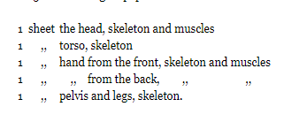
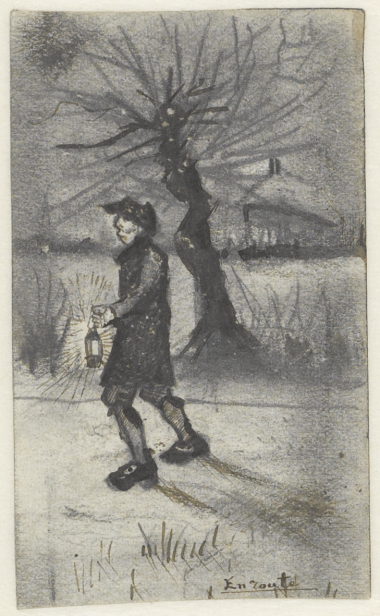

%{
position: 0,
summary: "Follow Van Gogh's footsteps in his journey to learn how to draw and how to paint, his first sketches, his course of actions and more. A detailed study with extracts from his letters.",
thumbnail: "/_resources/800bcfdd4dc24143962eda9641cef534.png"
}
---

# Introduction

This page contains extracts from [Van Gogh letters](http://vangoghletters.org/) related to his learning and practice journey as an artist, his footsteps as an artist. It contains his first sketches, his first drawings, his declaration of intent of being an arist, list of books that he studied, his first paintings and more.

The intent of this document is to understand how long it took him to learn how to draw, how was his daily practice, from where he learned from, who he consulted with and more.

With this summary, one can even follow Vincent's footsteps when learning how to draw and paint, and do the same as him, using the same books (they are all public domain), same drawing routine and same materials.

I was so absorbed when studying the subject, that I have read all of his letters from the first one to 194 in a single day (Monday, 20/09/2021), whilist creating those clippings and the timeline described here.

## Van Gogh's Letters?

The letters are the window to Van Gogh's universe. The letters express: as literature, as chronicle of an artist's life and Vincent's own sketches from his works and ideas.

Vincent’s correspondence falls into two parts: the letters he wrote himself – 820 in all, 651 of them to his brother Theo and 7 to Theo and his wife Jo – and those he received – 83, including 39 from Theo and 2 from Theo and Jo. By far the most letters are to his brother Theo, his best friend and loyal supporter. Theo kept Vincent's letters with great care. Vincent was less careful – he threw lots of letters away, or burned them.

See more:

- [https://en.wikipedia.org/wiki/The\_Letters\_of\_Vincent\_van_Gogh](https://en.wikipedia.org/wiki/The_Letters_of_Vincent_van_Gogh)
- http://vangoghletters.org/vg/

## Van Gogh

- Born: 30/03/1853
- Died: 29/07/1890 (37)
- [https://en.wikipedia.org/wiki/Vincent\_van\_Gogh](https://en.wikipedia.org/wiki/Vincent_van_Gogh)

## Formatting

- Numbers (ex: 193) refer to the letter number where the accompanying content/information was extracted from.
- I also added his age at the time of the writing of each letter alongside each letter number, in order to understand better how he progressed during his journey.
- Date format: DD/MM/YY.
    - In most cases I did not write the full number of the years (ex: 1880). But be aware that they obviously refer to the century of 1800's (ex: 07/09/74 refers to 07/September/1874).

# Books

This is not a list of all books [that Van Gogh read](https://artsandculture.google.com/exhibit/which-books-did-vincent-van-gogh-read-van-gogh-museum/kAKixNfo_Gy-IA?hl=en) (which [are too many](https://thamesandhudson.com/vincent-s-books-9780500094129) and from many subjects), but a list of specific books that Van Gogh read to learn art and that he used and referenced during his artistic learning journey:

- [Bargue's Exercises au fusain](https://archive.org/details/exercices-au-fusain-pour-preparer-a-letude-de-lacademie-dapres-nature-60-planches)
- [Bargue's Cours de dessin](https://archive.org/details/C.BargueDrawingCourse)
- Bargue's Les modèles d’après la bosse
- [A. de Zahn, Esquisses anatomiques à l’usage des artistes pour servir aux études d’après nature et d’après l’antique](https://books.google.dk/books/about/Esquisses_anatomiques_%C3%A0_l_usage_des_art.html?id=dNZPywAACAAJ&redir_esc=y)
- Guide de l’alphabet du dessin ou l’art d’apprendre et d’enseigner les principes rationnels du dessin d’après nature by Armand Théophile Cassagne. Paris 1880.
- [Traité d’aquarelle (Cassagne)](https://play.google.com/books/reader?id=tc_qAAAAMAAJ&hl=pt)
- [Eléments de perspective, Traité pratique de perspective and La perspective du paysagiste (Cassagne)](https://play.google.com/books/reader?id=C7tgEM6w9GsC&pg=GBS.PA60&hl=pt)

# Timeline

- 01/79: Started making drawings (afftected by the miners from the region of Boringe in Petit-Wasmes)
- 07/80: Rented attelier, making more and more drawings, decided to be a professional artist
- 09/80: Studying and practicing drawing intensively (mostly figure drawing with Bargue books)
- 10/80: Joined Academie Royale des Beaux-Arts (not known whether he ever attended any lessons, left quickly)
- 02/81: Theo would pay for all of Vincent's expenses from now on
- 09/81: Drawing breakthrough
- 12/81: Started learning Painting
- 01/82: Stops painting and focus only on drawing again
- 08/82: After more than 6 months of drawing and watercolor studies, goes back to Oil Painting, makes the "View at the sea" painting which is filled with sand

## Progress Highlights

### First Sketches

There's still no expressed desire about studying drawing or being an artist.

- **07/07/74, 21yrs (24)**: First sketches
- **04/75, 22yrs (32)**: Sketch in a letter
- **31/05/76, 23yrs (83)**: Sketch in a letter
- **25/11/76, 23yrs (99); 28/05/77, 24yrs (116); 13/11/78, 25 yrs (148)**: Three sparse sketches of buildings/landscapes.

### Drawing

- **20/08/80, 27yrs (156)**: Finally decides to become an artist, statrs copying drawings (Millet)
- **07/09/80, 27yrs (157)**: First 60 Bargue studies completed (from Bargue's Exercises au fusain)
- **24/09/80, 27yrs (158)**: Works on Bargue's Cours de dessin, first mention of studying Anatomy and Perspective, decided to work hard to master drawing
- **15/10/80, 27yrs (159)**: Bargue continued: Les modèles d’après la bosse and Portraits after Holbein, tries pen drawings
- **01/11/80, 27yrs (160)**: Anatomy drawings and studies (made a skeleton), starts studying human muscles, copied The diggers by Millet, studied portrait from Bargue, mentions interest in animal anatomy
- **01/81, 27yrs (162)**: All Bargue's Exercises au fusain for the 3rd time
- **16/02/81, 27yrs (153)**: Skeleton illustration in a day
- **02/04/81, 28yrs (164)**: Interested in proportions, focused on anatomical studies
- **12/04/81, 28yrs (165)**: First own composition?
- **30/04/81, 28yrs (166)**: Millet studies
- **06/81, 28yrs (168)**: Pen drawings, drawing in perspective, started studying watercolor
- **20/07/81, 28yrs (169)**: Portraits from photographs and from Bargue's
- **05/08/81, 28yrs (170)**: Bargue's Exercices au fusain again to focus on fundamentals
- **26/08/81, 28yrs (171)**: Makes a watercolor painting
- **mid. 09/81, 28yrs (172)**: Drawing breakthrough (repetition paid off), made many drawings
- **beg. 10/81, 28yrs (173)**: Drew The Digger
- **12/10/81, 28yrs (174)**: Keeps making studies and importance of Figure Drawing
- **17/10/81, 28yrs (177)**: Consider painting after 1yr of drawing; view trees as figures
- **02/11/81, 28yrs (178)**: Drew Boy cutting grass with a sickle

### Painting

- **03/12/81, 28yrs (191)**: Started Oil painting practice (made his 1st oil painting)
- **18/12/81, 28yrs (192)**: Painting every day, learning pallete/colors, watercolor
- **23/12/81, 28yrs (193)**: Getting serious, learning more color and tone

### Focus on Drawing Again
- **01/82**: Stops painting, goes back to drawing
- **05/08/82, 29yrs, (253)**: New perspective frame, Paint Palette made
- **10-11/08/82, 29yrs, (255)**: After more than 6 months devoted to drawing, considers drawing the skeleton and foundation of every painting, and goes back to oil painting; First seascape painting

### First Major Work: The Potato Eaters
His first major work was finished only in 06/05/85, 5 years after he started as an artist. I created a detailed page about [Van Gogh's Journey with The Potato Eaters](/wiki/art/van-gogh/van-gogh-journey-with-the-potato-eaters).

# Detailed timeline with letters and images

## 24 (07/07/74), 21yrs, First sketches

## 32 (04/75), 22yrs

Sketch in a letter, copied after Jean Baptiste Camille Corot.

A. Landscape at Ville-d’Avray (F Juv. XX / JH Juv. 3), letter sketch

Jean Baptiste Camille Corot Ville-d’Avray: The pond with boatman, 1862

## 83 (31/05/76), 23yrs

Made a sketch in a letter.

> Herewith a little drawing of the view from the school window where the boys stand and watch their parents going back to the station after a visit.4 Many a boy will never forget the view from that window. You should have seen it this week when we had rainy days, especially in the twilight when the 1v:3 street-lamps are being lit and their light is reflected in the wet street.

## 99 (25/11/76), 23yrs

Sketch: Small churches at Petersham and Turnham Green (F Juv. XXVIII / JH Juv. 8), letter sketch

## 116 (28/05/77), 24yrs

Sketch: The cave of Machpelah (F Juv. XXX / JH -), enclosed drawing

## 136 (03-04/12/77), 24yrs

Mentions *Bargue’s Cours de dessin* lying around, but still haven't started studying.

> While working today I had lying before me a sheet from Bargue’s Cours de dessin, 1st part, No. 39, Anne of Brittany.22 That was already hanging in my room in London with No. 53.

Bargue's plates

## 148 (13/11/78), 25yrs

Sketch: A. Café Au charbonnage (F Juv. XXXI / JH Juv. 9), enclosed sketch. Beside the café is a shed where, according to the sideboard ‘Charbons / Cokes &c.’ coal and similar fuels were sold.

## 156 (20/08/80), 27yrs, Decides to become an artist, started copying drawings
**Cuesmes**

- Finally decides to become an artist
- Started copying Millet, J. Breton, Feyen-Perrin
- Declares the need to study figures from Millet, J. Breton, Feyen-Perrin, and also Brion and Boughton
- Mentions Millet multiple times: the sower, the labours of the fields, the four times of the day

Sketch: Miners in the snow at dawn (F - / JH Juv. 10), letter sketch

## 157 (07/09/80), 27yrs, Copying Millet and first Bargue studies completed
**Cuesmes**

- Officially declared his art studies and practice?
- **Drew 60 sheets of Bargue's Exercises au fusain**
- Makings lots of copies of Millet
- Highlights the **importance of copying**

> I do much better for the time being by first copying some good things than by working without that foundation.
> 
> I first wanted to do Bargue’s Exercices au fusain, which Mr Tersteeg has been so kind as to lend me, and now I’ve finished the 60 sheets.
> 
> I couldn’t tell you how much Mr Tersteeg has pleased me by agreeing to let me have Bargue’s Exercices au fusain and Cours de dessin. I’ve worked on the first ones for a fortnight or thereabouts, from very early in the morning until evening, and day by day I’ve believed I could feel that it was making me stronger. But not with less, rather with more eagerness, I’m now doing The labours of the fields. It’s The sheep-shearers19 that are on the go now.

A copied Millet: Vincent van Gogh - The angelus (after Jean-François Millet) (F 834 / JH Juv. 14)

Sketch: Vincent van Gogh - Miners going to the mine (F 831 / JH Juv. 11)

## 158 (24/09/80), 27yrs, Bargue's Cours de dessin, mentions Anatomy and Perspective
**Cuesmes**

- Still working on **Bargue's Cours de dessin**
- Reading **Anatomy and Perspective**:
    - A. de Zahn, Esquisses anatomiques à l’usage des artistes pour servir aux études d’après nature et d’après l’antique (see letter 160, n. 2)
    - Guide de l’alphabet du dessin ou l’art d’apprendre et d’enseigner les principes rationnels du dessin d’après nature by Armand Théophile Cassagne. Paris 1880.
        - This book, consisting of 43 lessons, contained much on perspective, and helped to dispel Van Gogh’s doubts when he started to draw (as he later wrote in April 1882). It was, in his view, a ‘comprehensible’ work; letter 214).
- Focused on mastering how to draw well, declares that's it's tricky

> I’m still working on Bargue’s Cours de dessin, and plan to finish it before undertaking anything else, since day by day it exercises and strengthens both my hand and my mind
> 
> I’m busy reading a book on anatomy and another on perspective, which Mr Tersteeg also sent me.3 This study is thorny, and sometimes these books are as irritating as could be, but nevertheless I believe that I’m doing the right thing by studying them.
> 
> You can see, then, that I’m working like mad, but for the moment it isn’t giving very heartening results. But I have hopes that these thorns will bear white flowers in their time, and that this apparently sterile struggle is nothing other than a labour of giving birth. First pain, then joy afterwards.
> 
> I’ll pick up my pencil that I put down in my great discouragement and I’ll get back to drawing, and from then on, it seems to me, everything has changed for me, and now I’m on my way and my pencil has become somewhat obedient and seems to become more so day by day.
> 
> For me it’s a matter of learning to draw well, to be master either of my pencil or my charcoal or my brush; once that’s achieved I’ll do good things almost no matter where
> 
> I’ll stay quietly in some little workman’s house, where I’ll work as best I can.
> 
> I don’t know in advance what will be possible for me; nevertheless, I do hope to make some scratch yet in which there might be something human. But first I have to draw the Bargues and do other things that are rather tricky. The way is strait and the gate is strait and there are few that find it.

## 159 (15/10/80), 27yrs, Bargue continued, tries pen
**Brussels**

- Exercices au fusain and Les modèles d’après la bosse from Bargue, portraits after Holbein &c. in the 3rd part of the Cours de dessin
- Declares pen as hard
- "learn as quickly as possible to do presentable and saleable drawings"

> It’s also true that for the Exercices au fusain and Les modèles d’après la bosse from Bargue, I did draw them there all the same, either in the little study or outside in the garden, but now that I’ve come to the portraits after Holbein &c. in the 3rd part of the Cours de dessin
> 
> I’ve done a pen drawing after Millet’s woodcutter (the wood engraving that you sent me).5 I believe that drawing with the pen is a good preparation if later you might wish to learn etching. You can do a great deal with the pen, also, to enhance pencil drawings, but you don’t succeed the first time.
> 
> As for the drawing after Ruisdael’s Bush,6 I’d above all like to work at it in pen, and am preparing myself for that by making trial attempts with other drawings. Among others, I’ve done one of the head of Dante,7 which is somewhat like an etching. But it’s not as easy as it seems.
> 
> My goal must, for the moment at least, remain to learn as quickly as possible to do presentable and saleable drawings, so that I’ll begin to earn an income directly through my work.
> 
> Once I am master of my pencil or of watercolour or of etching, I can return to the region of the miners or weavers, to do things better from life than thus far. But first I must acquire a modicum of skill.
> 
> provided that I succeed one day in being able actually to draw what I wish to express, I’ll forget all that and will remember only the good aspect of things, which also exists if one is willing to observe it. But I must nevertheless try to build myself up a little, because I need all my energy.

Charles Bargue - Dante Alighieri, illustration in Charles Bargue, Cours de dessin. Paris 1868-1870, no. 34

Raphael (Rafaello Sanzio) - Head of Dante Alighieri, illustration in Charles Bargue, Cours de dessin. Paris 1868-1870, no. 32

## 160 (01/11/80), 27yrs, Anatomy drawings and studies (made a skeleton), starts muscles
**Brussels**

- Continue examples by Bargue
- Large pen drawing of a skeleton
- Proceeds to draw the muscles (torso and legs), and then body from the back and side
- Declares they are hard and that require patience
- Drew The diggers by Millet
- Mentions that wants to study anatomy of cow, sheep, horse
- "There are laws of proportion, of light and shadow, of perspective", "Drawing is a hard and difficult struggle."
- "character as it is expressed in facial characteristics and the shape of the skull"
- "one doesn’t achieve even that \[mediocre\] without much effort."

> I’m making headway with the examples of Bargue, and things are progressing. Moreover, I’ve recently drawn something that was a lot of work but I’m glad to have done it. Made, in fact, a pen drawing of a skeleton, rather large at that, on 5 sheets of Ingres paper.
> 
> 
> 
> I was prompted to do it by a manual written by Zahn, Esquisses anatomiques à l’usage des artistes.2 And it includes a number of other 1v:2 illustrations which seem to me very effective and clear. Of the hand, foot &c. &c.
> 
> And what I’m now going to do is complete the drawing of the muscles, i.e. that of the torso and legs, which will form the whole of the human body with what’s already made. Then there’s still the body seen from the back and from the side.
> 
> So you see that I’m pushing ahead with a vengeance, those things aren’t so very easy, and require time and moreover quite a bit of patience.
> 
> Drew The diggers by Millet after a photo by Braun that I found at Schmidt’s and which he lent me with that of The evening angelus. I sent both those drawings to Pa so that he could see that I’m doing something.
> 
> The Holbeins from the Modèles d’apres les maitres are splendid, I notice that now, drawing them, much more than before. But they aren’t easy, I assure you.
> 
> It’s my plan to get hold of the anatomical illustrations of a horse, cow and sheep, for example, from the veterinary school,4 and to draw them in the same way as the anatomy of a person.
> 
> There are laws of proportion, of light and shadow, of perspective, that one must know in order to be able to draw anything at all. If one lacks that knowledge, it will always remain a fruitless struggle and one will never give birth to anything.
> 
> That’s why I believe I’m steering a straight course by taking matters in hand in this way, and want to try and acquire a wealth of anatomy here this winter, it won’t do to wait longer and would ultimately prove to be more expensive because it would be a waste of time.
> 
> I believe that this will also be your point of view.
> Drawing is a hard and difficult struggle.
> 
> I had great pleasure lately in reading an extract from the work by Lavater and Gall. Physiognomie et phrénologie. Namely character as it is expressed in facial characteristics and the shape of the skull.
> 
> I believe that the longer you think about it the more you’ll see the definite necessity of more artistic surroundings for me, for how is one supposed to learn to draw unless someone shows you? With the best will in the world one cannot succeed without also coming into and remaining in contact with artists who are already further along. Good will is of no avail if there’s absolutely no opportunity for development. As regards mediocre artists, to whose ranks you think I should not want to belong, what shall I say? That depends on what one calls mediocre. I’ll do what I can, but in no way do I despise the mediocre in its simple sense. And one certainly doesn’t rise above that level by despising that which is mediocre, in my opinion one must at least begin by having some respect for the mediocre as well, and by knowing that that, too, already means something and that one doesn’t achieve even that without much effort.

### Anatomy

Albert de Zahn - 'Bones of the skull, frontal view' and 'Muscles of the head, frontal view', illustration in Esquisses anatomiques à l'usage des artistes

Albert de Zahn - 'Bones of the torso, with the neck and pelvis, frontal view', illustration in Esquisses anatomiques à l'usage des artistes

Albert de Zahn - 'Bones of the right hand, frontal view' and 'Muscles of the right hand, frontal view'', illustration in Esquisses anatomiques à l'usage des artistes

Albert de Zahn - 'Bones of the right hand, rear view' and 'Muscles of the right hand, rear view', illustration in Esquisses anatomiques à l'usage des artistes

Albert de Zahn - 'The bones of the legs seen from the left', illustration in Esquisses anatomiques à l'usage des artistes

### The diggers

Vincent van Gogh - Diggers (after Jean-François Millet) (F 829 / JH C.B.)

Vincent van Gogh - Diggers (after Jean-François Millet) (F 828 / JH Juv. 13)

Jean-François Millet - The two diggers

### Portrait

Hans Holbein the Younger - Daughter of Jacob Meyer, illustration in Charles Bargue, Cours de dessin. Paris 1868-1870, no. 10

Vincent van Gogh - Daughter of Jacob Meyer (after Hans Holbein the Younger) (F 833 / JH 13)

## 162 (01/81), 27yrs, Bargue's exercises for the 3rd time
**Brussels**

- "Not a day without a line"
- Made some drawings inspired by Lançon
- Bargue’s Exercices au fusain for the 3rd time
- 2 sketches

> I’m confident of succeeding in becoming more or less capable of working in magazine or book illustration. First and foremost, when I’ll be able to pay more for models, and female models too, I’ll make further progress; I feel it and I know it. And I’ll probably also succeed in being able to do portraits. But that depends on working hard; not a day without a line, as Gavarni used to say.
> 
> I’m now busy drawing all Bargue’s Exercices au fusain for the 3rd time.
> 
> Drawing figures and scenes of everyday life requires not only knowledge of drawing as a craft, but in addition, rigorous study of literature, physiognomy &c., which are difficult to acquire.

Sketch: A. On the road (F - / JH Juv. 15), enclosed drawing

Sketche: B. In front of the embers (F - / JH Juv. 16), enclosed drawing

## 163 (16/02/81), 27yrs, Skeleton illustration in a day
**Brussels**

- Wants to become an illustrator
- Copied a skeleton illustration in a day
- "true way to succeed, drawing from a model with the necessary costumes", "if I pursue drawing this seriously, seeking to portray reality, shall I succeed", "the main thing is that I progress and become better at drawing"
- Made a drawing of miners in the snow

> I found a very good illustration of a skeleton in that painter’s2 studio. Because such things are fairly difficult to find, I asked him whether he’d give it to me for a day or two in order to copy it. At first he objected, probably because he thought that I wouldn’t be able to do it or that it would take me too long, but I insisted on having it and he allowed me to. That was last Sunday afternoon, and as soon as I got home I started on it, and on Monday evening it was finished, and to his surprise I brought it back to him on Tuesday morning already and he thought my drawing good, and in fact it isn’t that bad
> 
> And all of this can get well and truly underway only when I have some kind of studio somewhere permanent.
> 
> This is the only true way to succeed, by drawing from a model with the necessary costumes. Only if I pursue drawing this thoroughly and seriously, always seeking to portray reality, shall I succeed, and then, despite the inevitable expenses, a living can be made out of it. Because a good draughtsman can certainly find work nowadays, and there’s a great demand for such individuals and there are positions to be had that pay very well. So the thing is to try and become as good at it as possible.
> 
> In Paris there are many draughtsmen who earn 10 or 15 francs a day, and in London and elsewhere just as much or even more, but one can’t achieve this all at once and I am by no means that far, but it could well come to that if I’m a little blessed and come again into contact with people like Mr Tersteeg and Theo and, more specifically, with good painters and draughtsmen. But only on the condition that a great deal of work and study be done.
> 
> And should I gradually begin to earn some money, that wouldn’t be disagreeable at all, even though the main thing is that I progress and become better at drawing. Then much will fall into place later on, whether it takes a long time or not.
> Models are expensive, relatively expensive at any rate, and if I could pay them and use them often I’d be able to work much better. But a studio then becomes indispensable. And people like Mr Tersteeg and Theo and others know this very well.
> 
> Anyway, I’ll have to wait until they write about one thing and another, and meanwhile do what I can.
> 
> Made a drawing of miners in the snow that’s a little better than the one from last winter, it has more character and effect.

## 164 (02/04/81), 28yrs, Interested in proportions, focused on anatomical studies
**Brussels**

- Talks about proportions
- Anatomical studies, not his own compositions
- "I gradually make progress"
- "without it \[proportions\] one can’t make a figure drawing quickly"
- "very beneficial for me to have \[...\] the anatomy of the horse and sheep, cow, \[...\] with a view to drawing the animals"
- a draughtsman draws for the love of drawing

> You speak of Heyerdahl as one who takes great pains to seek ‘proportions for the purpose of design’, that’s precisely what I need. Many good painters have no idea, or almost no idea, what ‘proportions for the purpose of design’ are, or beautiful lines or distinctive compositions, and ideas and poetry.
> 
> the words of Bernard Palissy remain true: ‘Poverty prevents good minds succeeding’.
> 
> Now you write about a manikin. There’s no particular hurry, but it would be of great use to me in composing and finding poses, you’re sensible of that. However, I’d rather wait a bit longer and have a better one than have a tool sooner that was far too inadequate.
> 
> working on with patient energy, I gradually make progress notwithstanding.d I mean to. Where there is a will there is a way.
> 
> Be sure and keep an eye out, though, for all manner of prints or books about proportion, and find out as much as you can about them, that’s of inestimable value, without it one can’t make a figure drawing quickly. Moreover, it would be very beneficial for me to have a thing or two about the anatomy of the horse and sheep, cow, not with an eye to veterinary medicine but rather with a view to drawing the aforementioned animals. If I’m asking you for all these things like this, it’s because you’ll most likely have an opportunity to find such prints very cheaply, relatively speaking, just as I’ve already found a few myself, and you’d perhaps pay them less heed if I hadn’t said that they’re of such great use to me. If you ever have an opportunity to ask Bargue or Viollet-le-Duc, for example, about those prints about proportion, that’s most probably the best place for such information.
> 
> Mauve learned a great deal from Verschuur about bringing a stable and a wagon into perspective, and the anatomy of a horse (Wouterus Verschuur, who mainly painted horses, had taught Anton Mauve.)
> 
> a draughtsman doesn’t draw for the sake of revenge but for the love of drawing, and that’s more compelling than any other reason. And so it’s likely that later on some things will be set to rights that aren’t quite right yet.
> 
> this winter the most important thing for me was to make strict anatomical studies and not my own compositions.

## 165 (12/04/81), 28yrs, First composition?

Is this his first composition?

Vincent van Gogh - The bearers of the burden (F 832 / JH C.B.)

> I sketched two drawings at Rappard’s, ‘The lamp-bearers’ and ‘The bearers of the burden’, the further execution of which I wanted to discuss with you. To finish them I must, one way or another, have the necessary models, and then I’m confident that something good will come of them, namely a couple of compositions

## 166 (30/04/81), 28yrs, Millet studies

- Finished copy of The Sower (again?)

Vincent van Gogh - The sower (after Jean-François Millet) (F 830 / JH 1)

> I’m very glad indeed that it’s been arranged for me to work here quietly for a while, I hope to make as many studies as I possibly can, for that’s the seed from which later drawings will grow.
> 
> I’ve started on the Millets, The sower is finished and the 4 times of the day sketched. And now still to come are The labours of the field.

## 168 (end of 06/81), 28yrs, Pen drawings, drawing in perspective, studying watercolor

- Marsh sketches (pen drawing)
- "subjects which required a lot of drawing, also drawing in perspective"
- Studying: Cassagne, Traité d’aquarelle

> I’ve received Cassagne, Traité d’aquarelle, and am busy studying it, even if I don’t make any watercolours I’ll probably find a great deal in it anyway, as regards sepia and ink, for example.
> 
> Because up to now I’ve been drawing with pencil only, worked up or heightened with the pen, if necessary with a reed pen, which makes broader lines.
> 
> That manner of working was implicit in what I’ve been drawing lately, for they were subjects which required a lot of drawing, also drawing in perspective, namely several workshops here in the village, a smithy, a carpenter’s shop and a clog-maker.
> 
> Rappard told me that he was also going to buy all of Cassagne’s books. He’s still struggling with perspective, and I know of no better remedy for that disease. If I, at any rate, am ever completely cured of it, I’ll have those books to thank for it. That’s to say, the putting into practice of the theory contained in them. The putting into practice can’t, however, be purchased with the books; were it so, perhaps more would be sold.
> 
> Armand Cassagne treated perspective not only in the above-mentioned Traité d’aquarelle (see n. 10) but also in various other books, such as Guide de l’alphabet du dessin, Eléments de perspective, Traité pratique de perspective and La perspective du paysagiste.

Vincent van Gogh - Marsh with water lilies

Vincent van Gogh - Marsh

## 169 (20/07/81), 28yrs, Portraits from photographs

- Portraits from photographs
- Copying drawings from the Bargue's

> even if my drawings are far from being what they should be, they’re nevertheless not getting worse, in my opinion
> I made another drawing in the Liesbos,
> I’m working at home these days, copying drawings by Holbein &c. from the Bargues. (probably Daughter of Jacob Meyer, after Holbein)
> Prompted by a thing or two you once said, I’ve also tried to draw a couple of portraits after photographs, and hold it to be a good exercise.

Vincent van Gogh - Edge of a wood (F 903 / JH 12)

Vincent van Gogh - Daughter of Jacob Meyer (after Hans Holbein the Younger) (F 833 / JH 13

Vincent van Gogh - Portrait, possibly of Willemien van Gogh (F 849 / JH 11)

Vincent van Gogh - Vincent van Gogh, the artist’s grandfather (F 876 / JH 14)

## 170 (05/08/81), 28yrs, Bargue's Exercices au fusain again to focus on fundamentals

- Studying Bargue's Exercices au fusain again to practice fundamentals over details
- "the ability to read a book easily and quickly and to retain a strong impression of it"

> I’m also busy drawing the Exercices au fusain on the Ingres paper that you brought. It costs me a great deal of effort to stick to that work. It’s much more stimulating to draw something outdoors than such a sheet from the Bargues, but still, I set myself the task of drawing them again, thus for the last time. It wouldn’t be good if, when drawing from nature, I lapsed into too much detail and overlooked the important things. And I found much too much of that in my last drawings. And that’s why I want to study Bargue’s method once more (who works with broad lines and large masses and simple, delicate contours). And if I let outdoor drawing rest for the moment, then when I come back to it in a short while I’ll have a better eye for things than I used to.
> 
> I’d wish that everyone had what I’m gradually beginning to acquire, the ability to read a book easily and quickly and to retain a strong impression of it. Reading books is like looking at paintings: without doubting, without hesitating, with self-assurance, one must find beautiful that which is beautiful.

## 171 (26/08/81), 28yrs, Makes a watercolor painting

- Gets feedback from his studies
- Watercolor painting of windmills

> because he attaches a certain value to my doing them \[bargue's again, from l.170\], at any rate, as well as to my copying a figure by Millet, Boughton or others now and then, and most people think that less worthwhile.
> 
> Corot’s figures may not be so well known as his landscapes, but that doesn’t mean that he didn’t make them. For that matter, in Corot every tree-trunk is drawn and modelled with attention and love as though it were a figure. And a tree-trunk by Corot is something altogether different from one by De Bock.
> 
> My own drawings interested Mauve more. He gave me a great many suggestions, which I’m glad of, and I’ve sort of arranged to pay him another visit fairly soon when I have some more studies.
> 
> If one draws on white, one must apply a flat tone to the whole sheet before beginning.
> 
> I’d seen a spot from the train that I wanted to draw. Namely the row of windmills.24 I got it done even though it was raining, and so at least I’ve brought home a souvenir from my outing.

Van Gogh, Windmills near Dordrecht (F 850 / JH 15), 1881 - Pencil, black and green chalk, pen and brush and ink, opaque watercolour - 25.7 x 59.8 cm

## 172 (mid. 09/81), 28yrs, Drawing breakthrough (repetition paid off), made many drawings
**Etten**

- Has a breakthrough in drawing (reached the next plateau of a skill?)
- Repetition paid off
- "what used to seem to me to be impossible is now gradually becoming possible"
- "learned to measure and to see and to attempt the broad outlines"
- "Diggers, sowers, ploughers, men and women I must now draw constantly"
- Made many drawings and watercolor paintings

> a change has come about in my drawing, both in my manner of doing it and in the result.
> 
> Prompted as well by a thing or two that Mauve said to me, I’ve started working again from a live model
> 
> The careful study, the constant and repeated drawing of Bargue’s Exercices au fusain has given me more insight into figure drawing. I’ve learned to measure and to see and to attempt the broad outlines &c. So that what used to seem to me to be desperately impossible is now gradually becoming possible, thank God. I’ve drawn a peasant with a spade no fewer than 5 times, ‘a digger’ in fact, in all kinds of poses,2 twice a sower,3 twice a girl with a broom.4 Also a woman with a white cap who’s peeling potatoes,5 and a shepherd leaning on his crook,6 and finally an old, sick peasant sitting on a chair by the fireplace with his head in his hands and his elbows on his knees.
> 
> And it won’t stop there, of course, once a couple of sheep have crossed the bridge the whole flock follows.
> 
> Diggers, sowers, ploughers, men and women I must now draw constantly. Examine and draw everything that’s part of a peasant’s life. Just as many others have done and are doing. I’m no longer so powerless in the face of nature as I used to be.
> 
> ‘the factory is in full swing’, as Mauve says.

### Sketches

### Finished drawings and paintings

Vincent van Gogh - Boy cutting grass with a sickle

Vincent van Gogh - Woman peeling potatoes

Vincent van Gogh - Woman peeling potatoes

Vincent van Gogh Man sitting by the fireplace ('Worn out') (F 863 / JH 34), 1881 - Pen, watercolour - 23.5 x 31 cm

Vincent van Gogh - Storm clouds over a field (F 1676 / JH 36), 1881 - Pencil, black chalk, washed, heightened with white - 46 x 49 cm

## 173 (beg. 10/81), 28yrs, Drew The Digger
**Etten**

- Got box of paints to start with

> two large drawings (chalk and some sepia) of Pollard willows, something like the sketch below.
> Also the same, but vertical, of Leurseweg. Then I had a model a couple of times, digger and basket-maker.
> 
> And then last week I got a box of paints from Uncle Cent that is rather good, certainly good enough to start with (the paint is from Paillard). And I’m very glad to have it.
> 
> That thick Ingres paper9 is especially good for drawing with watercolour, and a great deal cheaper than other paper.

Van Gogh, Digger (F 866 / JH 54), 1881 - Charcoal, black and green chalk, transparent and opaque watercolour - 62.2 x 46.8 cm

## 174 (12/10/81), 28yrs, Keeps making studies and importance of Figure Drawing
**Etten**

- Studies of diggers, sowers, men and women
- Working a lot with charchoal and Conté
- Focusing on Figure Drawing was a good choice, it influences landscape drawing, "because one learns to concentrate"

> I’ve been drawing a lot from the model lately, since I’ve found a couple of models who are willing enough. And I have all kinds of studies of diggers, sowers &c., men and women.6 I’m working a lot with charcoal and Conté at the moment, and have also tried sepia and watercolour. Anyway, I can’t say whether you’d see improvement in my drawings, but most certainly a change.
> 
> I hope to visit Mauve again soon to discuss the question of whether or not I should start painting. If I start, I’ll also persevere. I’ll talk it over again with various people before I begin, though. I realize more and more as time goes on that it was good that I set my mind more specifically on figure drawing. Indirectly, this really does influence landscape drawing as well, because one learns to concentrate.

Sower with a sack (F 857 / JH 32), 1881 - Pen and brown ink, heightened with blue - 11.5 x 7 cm

## 175 (15/10/81), 28yrs, Things are beginning to go more smoothly
**Etten**

- "figure drawing in particular is good, that it also works indirectly to the good of landscape drawing"
- "work now and then with watercolour and sepia, but that isn’t immediately successful."
- "Nature is most certainly ‘intangible’ though, yet one must seize it, and with a firm hand."
- "After spending some time wrestling and struggling with nature, it’s starting to become a bit more yielding and submissive, not that I’m there yet, things are beginning to go more smoothly"

> That Mr Tersteeg said what he said to you about my drawings pleases me, as does, certainly no less so, your finding progress in the sketches I sent. If it’s beginning to manifest itself, I most certainly hope to work to the utmost, so that neither you nor Mr Tersteeg will have to retract that rather favourable opinion. I’ll do my best not to betray you in this. Nature always begins by resisting the draughtsman, but he who truly takes it seriously doesn’t let himself be deterred by that resistance, on the contrary, it’s one more stimulus to go on fighting, and at bottom nature and an honest draughtsman see eye to eye. Nature is most certainly ‘intangible’ though, yet one must seize it, and with a firm hand. And now, after spending some time wrestling and struggling with nature, it’s starting to become a bit more yielding and submissive, not that I’m there yet, no one is less inclined to think so than I, but things are beginning to go more smoothly. The struggle with nature sometimes resembles what Shakespeare calls ‘Taming the shrew’4 (i.e. to conquer the opposition through perseverance, willy-nilly). In many things, but more particularly in drawing, I think that delving deeply into something is better than letting it go.
> 
> I feel more and more as time goes on that figure drawing in particular is good, that it also works indirectly to the good of landscape drawing. If one draws a pollard willow as though it were a living being, which it actually is, then the surroundings follow more or less naturally, if only one has focused all one’s attention on that one tree and hasn’t rested until there was some life in it. Herewith a couple of sketches, I’m rather busy in Leurseweg these days.6 Also work now and then with watercolour and sepia, but that isn’t immediately successful.
> 
> De Bock, if you and I were to concentrate on figure drawing for a whole year, afterwards we’d both be completely different people from what we are now; if we fail to get a grip on ourselves and simply go on without learning anything new, we won’t even remain what we are but, standing still, we’ll go backwards. If we don’t draw figures, or else trees as though they were figures, then we’re like people who have no spine, or at least one that’s too weak. Millet and Corot, whom we both like so much, could they paint a figure or couldn’t they? I mean, those Masters balked at nothing. And he admitted that I was largely right.
> 
> what is easier, painting a panorama or refusing to paint a panorama? What is more artistic, doing it or not doing it? I don’t know whether those were his exact words, but the reply was most certainly in this vein, and I found it very much to the point.

## 176 (15/10/81), 28yrs, Advice: Study the nude and clothed figures
**Etten**

- Advice to Rappard: Study the nude and clothed figures
- "One must have a understanding of the nude, \[...\] and yet in reality we’re confronted with clothed figures."

> It’s my view, Rappard, that you must nevertheless work especially from a clothed model.
> 
> One must have a thorough understanding of the nude, that’s indispensable, and yet in reality we’re always confronted with clothed figures.
> 
> Unless you were intending to follow in the tracks of Baudry, Lefebvre, Henner and so many others who are specialized in the nude. In that case you must study the nude almost exclusively; in that case, the more you focus almost exclusively on it and concentrate on it, the better. But I really don’t think that you’ll take that path. You have too much feeling for other things, a woman gathering potatoes in the field, a digger, a sower, a lady in the street or at home, you find them all too beautiful not to get around to attacking them, in a completely different way than you have up to now. You have too much feeling for colour, too much sentiment for tone, you’re too much of a landscapist to follow in the footsteps of Baudry. The more so because I believe that you, Rappard, will end up settling in Holland. You’re too much of a Dutchman to become a Baudry. But that you paint such beautiful studies of nudes as the two large ones that I know of yours, that recumbent pose and that brown, seated figure, this I think excellent, and I wish that I’d done them.
> 
> Your comment on that figure of the sower — of which you said, it’s not a man sowing but a man posing as a sower — is very true.7
> 
> I consider my current studies, however, to be studies from a model, they have no pretension of being anything else.
> 
> Only in a year or two will I get down to making a sower who is sowing, I agree with you there.
> 
> even though I’m a comparative beginner as a draughtsman I nevertheless have a broad view of art in general, you mustn’t take it too lightly if I sometimes say a thing or two.

## 177 (17/10/81), 28yrs, Consider painting after 1yr drawing; view trees as figures
**Etten**

- It’s settled that I’ll also set about painting
- "when I’ve gained some understanding of painting I’ll get around to expressing some of it", "now that I’m drawing figures I’ll go on with that until I’ve made a good deal more progress"
- "If I work outdoors it will be to do studies of trees, though actually **viewing the trees as if they were figures**."
    - An eye to outline, proportion and how they’re constructed
    - After that, the modelling and the colour and the surroundings
- Better to have drew for a year, instead of starting with painting.
    - "It’s better, **that I’ve got the paints only now, after having drawn exclusively for at least a year**, than if I’d started with it immediately"

> it’s settled that I’ll also set about painting, and I’m really glad it’s come to this.
> 
> Well, recently I’ve done a great deal of drawing, especially figure studies. If you saw them now, you’d surely see what direction I’m taking.
> 
> Naturally I’m extremely eager to hear what M. will have to say to me.
> Have also drawn some children recently, and I liked that very much.
> 
> These days it’s beautiful outdoors in colour and tone, when I’ve gained some understanding of painting I’ll get around to expressing some of it, but we have to persevere, and now that I’m drawing figures I’ll go on with that until I’ve made a good deal more progress, and if I work outdoors it will be to do studies of trees, though actually viewing the trees as if they were figures.
> 
> I mean, viewing them particularly with an eye to outline, proportion and how they’re constructed. That’s the first thing one has to consider. After that comes the modelling and the colour and the surroundings, and it’s precisely this problem that I must discuss with M.
> 
> But Theo, I’m really so happy with my painting box, and it’s better, it seems to me, that I’ve got it only now, after having drawn exclusively for at least a year, than if I’d started with it immediately. I think you’ll agree with me there.
> 
> Theo, my actual career begins with painting, don’t you think it’s all right to see it that way?

## 178 (02/11/81), 28yrs, Drew Boy cutting grass with a sickle
**Etten**

- "we must nevertheless have misgivings about ourselves and be on our guard against ourselves when we sense we’re on the right path"

> Nothing is more agreeable to me than to discover good qualities, even in such people.
> 
> But considering that I’m utterly determined to see things from the positive, good side in the first place, and to see the bad side only afterwards and with reluctance, I thus take it that even if I haven’t already got it entirely, eventually I’ll succeed in acquiring a generally mild and broad and unprejudiced opinion. And that’s why I consider it one of the petty vexations of human life to meet someone who thinks he’s always right and wants to be regarded as someone who’s always right, that’s why, I say, because I’m so very convinced of my own fallibility and also that of all the sons of men
> 
> When you make strong studies of nudes, whether at the academy or elsewhere, like those of yours that I’ve seen, when I draw diggers in the potato field, those are good things of ours, and we’ll progress thereby. But in my opinion, despite that, we must nevertheless have misgivings about ourselves and be on our guard against ourselves when we sense we’re on the right path. Then we must say: by all means let me take care because I’m just the sort of man to spoil things for myself when they’re going well unless I take care. Now how should we take care???..... I can’t say exactly, but that it’s necessary to take care in the aforementioned case, yes, I do think so, because through my own bitter experience, by learning the hard way, I’ve become aware of what I’ve underlined above. That this awareness of my own fallibility will prevent me from making many mistakes doesn’t alter the fact that I’m bound to make a great many mistakes anyway. But if we fall, we get up again!

Van Gogh, Boy cutting grass with a sickle (F 851 / JH 61), 1881 - Black chalk, charcoal, wash, opaque watercolour - 46.6 x 60.4 cm

## 184 (12/11/81), 27yrs
**Etten**

Van Gogh, Workman sitting on a basket, cutting bread (F 1663 / JH 272), 1882 - Transfer lithography, crayon and autographic ink - 49 x 31.5 cm

## 185 (18/11/81), 28yrs
**Etten**

- Drew Man by the Fireplace
- Acknowledges that "perhaps it's all the better that I don't use professional models"
- "Let us love what we love, let us be ourselves"

Van Gogh, Man sitting by the fireplace (F 868 / JH 80), 1881 - Black chalk, reddish brown and grey wash, orange-red chalk, opaque watercolour - 55.8 x 44.5 cm

## 191 (03/12/81), 28yrs, Started Oil painting practice, first still life
**The Hague**

- With Mauve
- Practice painting with Mauve
- Created still life painting (first oil painting?)
- "I'll be learning to make watercolors within a relatively short time"

Still life with an earthenware pot and clogs (F 63 / JH 920), 1881 - Oil on canvas on panel - 39 x 41.5 cm

## 192 (18/12/81), 28yrs, Painting every day, learning pallete/colors, watercolor
**The Hague**

- With Mauve every day
- During the day: painting
- During the evening: drawing
- 5 studies, 2 watercolors
- "I must go on working hard"
- Enlightened by Mauve in ths mysteries of the pallette and painting and watercolor
- "The Sun is rising for me, but that it's still shrouded in mist"
- "How marvellous watercolor is for expressing space and airness"

### Paintings

Still life with cabbage and clogs (F 1 / JH 81), 1881 - Oil on paper on panel - 34 x 55 cm

Still life with a straw hat (F 62 / JH 922), 1881 - Oil on paper on canvas - 36.5 x 53.6 cm

Scheveningen woman sewing (F 869 / JH 83), 1881 - Watercolour - 38 x 35 cm

Scheveningen woman knitting (F 870 / JH 84), 1881 - Watercolour - 51 x 35 cm

Scheveningen woman (F 871 / JH 85), 1881 - Pencil, transparent watercolour - 23.4 x 9.8 cm

### Sketches

## 193 (23/12/81), 28yrs, Getting serious, learning more color and tone
**Etten**

- Asks Theo for more Ingres paper: "excellent for studies and scratches"
    - Not white, the colour of unbleached linen
- Getting constructive feedback from Mauve
- "I now consider myself to be at the beginning of the beginning of making something serious"
- "what a great thing tone and colour are"
- "M. has taught me to see so many things I didn’t see before"
- "I’d be the first to say that I’m still very dissatisfied with them, and yet, it’s different from what I’ve done up to now, and it looks fresher and sounder"
- "one can’t do what one wants all at once. It comes gradually"

> But if he tells me, this or that isn’t good, then it’s because he’s saying at the same time ‘but try it this way or that way’, and that’s entirely different from criticizing for the sake of criticizing. Or if someone says ‘you’re ill with this or that’, that doesn’t help much, but if someone says ‘do this or that and you’ll get better’, and his advice isn’t deceit, look, that’s the real thing, and – and – it naturally helps. Now I’ve come from him with a few painted studies and a couple of watercolours. Of course they aren’t masterpieces and yet I truly believe there’s something sound and real in them, more at least than in what I’ve made up to now. And so I now consider myself to be at the beginning of the beginning of making something serious. And because I now have a few more technical resources at my disposal, namely paint and brush, all things are made new again,4 as it were.
> 
> But – now we have to put it into practice. And the first thing is that I must find a room large enough to be able to take a sufficient distance. Mauve just said to me, when he saw my studies, ‘you’re too close to your model’.
> In many cases this makes it next to impossible to take the necessary measurements for the proportions, so this is certainly one of the first things I have to watch out for. Now I must arrange to rent a large room somewhere, be it a room or a shed. And that won’t be so terribly expensive.
> 
> Theo, what a great thing tone and colour are! And anyone who doesn’t acquire a feeling for it, how far removed from life he will remain! M. has taught me to see so many things I didn’t see before, and when I have the opportunity I’ll try and tell you about what he’s told me, because perhaps there are still one or two things that you don’t see properly either. Anyway, we’ll talk about artistic matters sometime, I hope.
> 
> I do wish that you could see the two watercolours I’ve brought with me, because you would see that they’re watercolours just like any other watercolours. There may be many imperfections in them, be that as it may, I’d be the first to say that I’m still very dissatisfied with them, and yet, it’s different from what I’ve done up to now, and it looks fresher and sounder. All the same, it must become much fresher and sounder, but one can’t do what one wants all at once. It comes gradually. I need those couple of drawings myself, however, to compare with what I’ll be making here, because I have to do them at least as well as what I did at M.’s.

## 250 (23/07/82), 29yrs, Complicated perspective drawings and watercolors; Perspective frame
**The Hague**

- Works in his drawings from early in the morning until night
    - "you must imagine me sitting at my attic window as early as 4 o’clock, studying the meadows and the carpenter’s yard with my perspective frame"
- Mentions of the importance of perspective, the usage of a perspective frame
- "if I work at drawing, the correctness of perspective and proportion, it also benefits the watercolouring"
- "after doing nothing but drawing for a time (around six months), I found watercolours easier"

> **The work itself makes me much more clear-headed, of course — towards the end I couldn’t bear not being able to draw**. I’ll have a couple of watercolours for you when you come, brother. You **remember, last winter I said: in a year you’ll have watercolours**.
> 
> These ones are simply intended to **show you that if I work at drawing, the correctness of perspective and proportion, it also benefits the watercolouring**.
> 
> And for myself I did them to test whether now, **after doing nothing but drawing for a time (around six months), I found watercolours easier, and secondly to see where I still need to do more work on the foundation or basic drawing on which everything depends**.
> 
> They’re landscapes, **very difficult in their delineation, with complicated perspective** — but precisely because of that there’s a true Dutch character and sentiment to them. They look like the last ones I sent, and are no less conscientiously delineated, only now there’s also: colour — the gentle green of the meadow contrasting with the red tiled roof, the light in the sky set off by the matt tones of the foreground, a yard with earth and damp wood.
> 
> In judging me and my behaviour, Tersteeg always starts from the premise that I’m incapable of anything and am good for nothing. He told me that himself... ‘Oh, it will be the same with that painting of yours as with all the other things you’ve started — it won’t come to anything.’
> 
> I can’t tell you how much I enjoy the space in the studio — I immediately notice the effect on me now that I’m working again.
> 
> So **you must imagine me sitting at my attic window as early as 4 o’clock, studying the meadows and the carpenter’s yard with my perspective frame** — as the fires are lit in the court to make coffee, and the first worker ambles into the yard.
> 
> Over the red tiled roofs comes a flock of white pigeons flying between the black smoking chimneys. But behind this an infinity of delicate, gentle green, miles and miles of flat meadow, and a grey sky as still, as peaceful as Corot or Van Goyen.
> 
> That view over the ridges of the roofs and the gutters in which the grass grows, very early in the morning and the first signs of life and awakening — the bird on the wing, the chimney smoking, the figure far below ambling along — this is the subject of my watercolour.
> 
> **Whether I succeed in the future depends, I believe, more on my work than on anything else**. Provided I can stay on my feet, well I’ll fight my fight quietly in this way and no other, that is **by calmly looking through my little window at the things in nature, and drawing them faithfully and lovingly**.
> 
> **The singular effects of perspective are more intriguing to me than human intrigues**.

## 251 (26/07/82), 29yrs, Acknowledges drawing as the most important skill
**The Hague**

- More detailed watercolors
- In painting, almost everything comes down to the drawing quality, the sketch is the most important step
- "Anyone who works with love and with intelligence has a kind of armour against people’s opinion in the sincerity of his love for nature and art"

> it isn’t harder to work in colour than in black and white, the opposite perhaps, but as far as I can see **3/4 comes down to the original sketch**, and almost **the whole watercolour depends on its quality**.
> 
> I think this is why I now work **much more fluently in watercolour, because for such a long time I did my best to draw more correctly**.
> 
> **I saw a dead pollard willow there**, just the thing for Barye, for example. It hung over a pond with reeds, **all alone and melancholy**, and its bark was scaled and mossy, as it were, and spotted and marbled in various tones — something like the skin of a snake, greenish, yellowish, mostly dull black. With white flaking spots and stumpy branches. I’m going to attack it tomorrow morning.
> 
> Done a bleaching ground at Scheveningen, **on the spot in one go, entirely in wash almost without preparation**, on a very coarse piece of torchon. Here are a couple of small sketches of it.
> 
> **everything else depends on work**, and I see everything as directly related to that.
> 
> I’ve become very caught up in landscapes. The reason is that Sien can’t pose yet, but otherwise **the figure must remain the chief concern**.
> 
> I’m so used to my working clothes, **I can sit or lie in the sand or grass as I please** (in the dunes, I hardly ever use a chair, except perhaps an old fish basket), that **my outfit is rather too Robinson Crusoe-like for me to accompany you**.
> 
> nearer winter I hope to have figure watercolours, that is, after I’ve been here a year. First **I’ll have to draw more nudes and a lot more in black and white**
> 
> **Anyone who works with love and with intelligence has a kind of armour against people’s opinion in the sincerity of his love for nature and art**. Nature is severe and hard, but never deceives and always helps you to go forward.
> 
> if I felt no love for nature and my work, then I would be unhappy. But **the less I get on with people the more I learn to trust nature** and to concentrate on it.
> 
> I’m not afraid of a fresh green or a soft blue and the thousand different greys, for **there’s hardly any colour that isn’t a grey**: red-grey, yellow-grey, green-grey, blue-grey. This is what all colour mixing comes down to.

Fish-drying barn (F 945 / JH 160), 1882 - Watercolour - 35.5 x 52 cm

Fish-drying barn (F 940 / JH 154), 1882 - Pen, pencil, heightened with white - 28.5 x 45 cm

## 252 (31/07/82), 29yrs, Importance of Drawing; Fundamentals of color; Commercial value
**The Hague**

- Talks about the simplicity of fundamentals of colors.
- Highlights, once again, the importance of sketching and an well observed outline, for a painting.
- Mentions that making art with an eye only for profits is not the right way to do it.
	- Personal note: he would get very sick if he saw how his work is handled by the art world, especially the multi-millionaire auctions and the commercialization of his work as a "brand" (jewelry, pottery, etc).

> To make notes outdoors, or make a small scratch [sketch], **a highly developed feeling for the outline is absolutely essential**, as it is for working it up later.
>
> This doesn’t come of its own accord, but firstly through **observation, and then above all through persistent hard work and seeking. Some study of anatomy and perspective is also required**.
> 
>  I feel the cardinal **importance of the outline** most clearly
>  
> [Watercolours are] founded on drawing first, and then **from the drawing springs not only the watercolour but all kinds of other shoots** that will develop in due course in me
>
> When I see how **several painters I know here struggle** with their watercolours and paintings, unable to find the answer, I sometimes think, friend, **your drawing is where the trouble lies**. I don’t for a moment regret not moving straight on to watercolour and painting.
> 
> **When I see young painters composing and drawing off the top of their head** [...], making what they can of it, **it makes me feel feeble and faint**. The whole thing makes me sick!
> 
> **If I go on just drawing, I do that for two reasons**. I want to **acquire a sure hand when drawing** above all else and, second, because painting materials [...] entail considerable expense for which there’s no return in the early stage. If I got into debt or surrounded myself with canvases and papers daubed all over with paint without being sure of my drawing, my studio would quickly become a kind of hell
> 
> I’ve attacked that old giant of a pollard willow, and I believe it has turned out the best of the watercolours. I wanted to make it like how I imagine the signalman [in the railway in the distance] with his smock and red flag must see and feel it when he thinks: how gloomy it is today. In the watercolour itself there’s no black except in a mixed state. The greatest [dark] strengths are in the watercolour — dark green, brown, dark grey.
> 
> I sometimes laugh heartily at how people suspect me (**I am really just a friend of nature, of study, of work — and of people chiefly**) of various acts of malice and absurdities which I never dream of.

### Study from nature and commercial value

> Working faithfully from nature and with persistence seems to me a sure way. The duty of the painter is to **study nature in depth and to use all his intelligence, to put his feelings into his work so that it becomes comprehensible to others**
>
> As for the commercial value of my work, I have no pretensions. **Working with an eye to saleability isn’t exactly the right way in my view**, but rather is cheating art lovers. **The true artists didn’t do that**; the sympathy they received sooner or later came because of their sincerity. It mustn’t become a speculation that might well go wrong and would certainly waste time that ought to be spent on work.

### Fundamentals of color

> Absolute black doesn’t in fact occur. Like white, however, it’s present in almost every colour and forms the endless variety of greys — distinct in tone and strength. In nature one in fact sees nothing but these tones or strengths.
> 
> The 3 fundamental colours are	red, yellow, blue
> The 3 composite colours are orange, green, purple
>
> From these are obtained the endless variations of grey by adding black and some white — red-grey, yellow-grey, blue-grey, green-grey, orange-grey, violet-grey.
> 
> a good understanding of them [fundamentals] is worth more than 70 different shades of paint — given that more than 70 tones and strengths can be made with the 3 primary colours and white and black
> 
> The colourist is he who on seeing a colour in nature is able to analyze it coolly and say, for example, that green-grey is yellow with black and almost no blue, &c. In short, knowing how to make up the greys of nature on the palette.

Pollard willow (F 947 / JH 164), 1882 - Watercolour - 36 x 56.5 cm

## 253 (05/08/82), 29yrs, New perspective frame ordered; Palette made
**The Hague**

> **I have to try twice as hard** to make up for lost time because **I began later than others**, and with the best will in the world I would have to give up if I didn’t have you [financial support from Theo].
>
> before the summer ends I hope to practise bigger sketches in charcoal with an eye to painting in a rather larger format later.
> 
> This is why I’m having a new and, I hope, **better perspective frame made, which will stand firmly on two legs in uneven ground like the dunes**.
>
> I place great value on having good materials, and would like my studio to look substantial ... through the studies on the walls and good tools. That will have to come with work and time.

Perspective frame

### Van Gogh's Palette
> I now have all the essentials for proper painting. **I’ve limited myself to simple colours** in both watercolour and oil: ochre (red, yellow, brown), cobalt and Prussian blue, Naples yellow, terra sienna, black and white, supplemented with some carmine, sepia, vermilion, ultramarine, gamboge in smaller tubes.

Palette sketch

## 254 (05-06/08/82), 29yrs, New perspective frame; Back to painting after 6 months
**The Hague**

- The perspective frame ordered with the generous amount of money given by Theo in 252 is now in Vincent's hand
- Decides to go back to painting: "In January, I was still too hesitant when drawing. Now six months have passed, devoted entirely to drawing. So now I’m beginning anew with fresh heart**"

> I’ve just come back from the blacksmith, who has put iron spikes on the legs and iron corners on the frame. It consists of two long legs

> The result is that on the beach or in a meadow or a field **you have a view as if through a window**. The perpendicular and horizontal lines of the frame, together with the diagonals and the cross — or **otherwise a grid of squares** — provide **a clear guide to some of the principal features**, so that one can make a drawing with a firm hand, setting out the broad outlines and proportions. Assuming, that is, that one has a feeling for perspective and an understanding of **why and how perspective appears to change the direction of lines and the size of masses and planes**.
> 
> I expect you can imagine how **delightful it is to train this view-finder on the sea, on the green fields** — or in the winter on snow-covered land or in the autumn on the fantastic network of thin and thick trunks and branches, or on a stormy sky. 
> 
> **With CONSIDERABLE practice and with lengthy practice**, it enables one to **draw at lightning speed** and, once the lines are fixed, to paint at lightning speed.
> 
> It’s in fact especially good for painting, because a brush must be used for sky, ground, sea. Or, rather, to render them through drawing alone, it’s necessary to know and feel how to work with the brush.
>
> I also firmly believe **my drawing would be strongly influenced if I were to paint for a while**.
>
> **I tried it back in January but that came to a halt — the reason for stopping, apart from a few other things, was that I was still too hesitant when drawing. Now six months have passed, devoted entirely to drawing. So now I’m beginning anew with fresh heart**. The frame really has become an excellent piece of equipment.
> 
> I’ll start doing large charcoal drawings with it, as well as painting small studies — if those two things come off, I hope that better painted work will soon follow.
> 
> my aim is to learn a couple of things about technique through this landscape painting which I feel **I’m in need of for my FIGURES**, rendering **different fabrics, and the tone and colour**. In a word, the expression of the body — the mass — of things. There’s no turning back now.

## 255 (10-11/08/82), 29yrs, Back to painting after 6 months; First seascape painting
**The Hague**
- Back to oil painting, after a 6 month stop since January.
- "Drawing is the skeleton supporting everything else"

> I have 3 painted studies [These three paintings are not known]. I must say that **painting is not as alien to me as you might think**. On the contrary, I find it very appealing on account of it being **a powerful means of expression**.
> 
> I believe that **even in these first ones** [studies] you’ll already see that there’s something of the open air in them, **something that proves I have a feeling for nature and the heart of a painter**. 
> 
> one can say delicate things with it too [painting] — let a soft grey or green speak in the midst of roughness.
> 
> I would like quietly to amass a good number of painted studies to hang in my studio
> 
> **I’ve put a lot of work into drawing and will continue to do so, because it’s the backbone of painting, the skeleton supporting everything else**.
> 
> Before I paint bigger things, I’ll draw them bigger. Or, if I can find out the technique make what they call grisailles [monochrome drawings or paintings, generally in grey or brown].  It becomes too expensive a business if you’re not sparing with the paint.
> 
> I kept my letter back and marched off to the beach this morning, and have just got back with a **fairly large painted study of sand, sea and sky**, and a few fishing-boats and men on the beach. There’s still dune sand in it.
> 
> after a month of regular painting the studio will look completely different

Beach with fishing boats (F 2 / JH 173), 1882 - Oil on paper on panel

## 259 (26/08/82), 29yrs, View of the sea painting (filled with sand)
- The painting has been filled with sand, then scrapped and remade

> All this week we’ve had gales, storms and rain here, and I’ve been to Scheveningen many times to see it. And came back with two small seascapes. There’s already a lot of sand in the one, but with the second, when there really was a storm and the sea came very close to the dunes, **I had to scrape everything off twice because of the thick layer of sand completely covering it**. The wind was so strong that I could barely stay on my feet and **barely see through the clouds of sand**. I **tried to get it down anyway by immediately painting it again in a small inn behind the dunes**, after first scraping it all off, and then going out to take another look from there.

> **Figure painting attracts me enormously, but it still has to ripen**. I need to become better acquainted with the method — what is sometimes called ‘the cookery of art’. In the beginning I’ll have to scrape off a great deal — and often make a new start – but I feel that I’m learning as a result, and that it gives me a new, fresh view of things.

View of the sea at Scheveningen (F 4 / JH 187), 1882 - Oil on canvas, Van Gogh Museum

## From 484 (02/03/85), 31yrs to 501 (06/05/85), 32yrs, First Major Work: The Potato Eaters

Check [Van Gogh's Journey with The Potato Eaters](/wiki/art/van-gogh/van-gogh-journey-with-the-potato-eaters).

# Credits

- Van Gogh Museum, Amsterdam, Huygens ING, The Hague
- http://vangoghletters.org/vg/credits.html