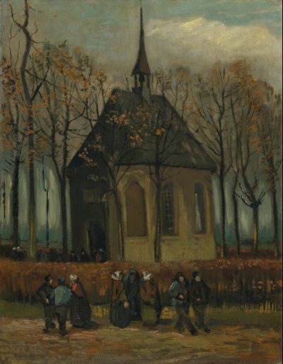

%{
position: 2,
summary: "Van Gogh's route on learning how to paint.",
}
---

# Introduction
This page is still very much a work in progress.

See more:
- [Van Gogh Learning Journey
](/wiki/art/van-gogh/van-gogh-learning-journey)
- [Van Gogh Journey with The Potato Eaters
](/wiki/art/van-gogh/van-gogh-journey-with-the-potato-eaters)

# Detailed timeline with letters and images

## 419-427 (04-24/01/84), 30yrs, Weavers Studies
>  I’ve been studying the weavers while I’ve been here.
>  
> Do you know many drawings of weavers? I only very few.
So far I’ve made 3 watercolours of them. These folk are difficult to draw because in the small rooms one can’t get far enough away to draw the loom. I think this is why attempts to do it usually fail. However, I’ve found a room here where there are two looms and where it can be done. (419)

> In these last few weeks I have made 4 watercolours of Weavers. And a few others of a timber sale, an interior with a seamstress, and a gardener, all watercolours. (421)

> I don’t think there’s been a day since I’ve been here when I haven’t sat working with the weavers or peasants from morning till night. (422)
> I was painting at a peasant’s [...] (423)

> I already told you that I’m working on watercolours of the weavers here. I’ll try to get some finished. (425)

> I’m still working on the weavers, but I’m afraid I’ll only be able to work half-time for a long while [...].
>
> I’ve made various studies in watercolour directly from life. I’ll make a start on some watercolours after them, because I have to stay in the house most of the time now. (426)

> I’m at a weaver’s nearby, where I’m working on 2 painted studies. (427)

# 428 (03/02/84), 30yrs, Neunen Church Painting
> Vincent also remains tireless and he moreover spends the day painting and drawing with exemplary ambition’, and nine days later ‘Vincent remains exemplary in nursing and is also working with the greatest ambition on drawing and painting. I do so hope that his work might find some approbation. For he works so much it is exemplary. - Mr van Gogh (Vincent's father)
> 
> Every day I paint studies of the weavers here, which I think are better in technique than the painted studies from Drenthe that I sent you.
> 
> I think those things of the looms with that quite complicated machinery, in the middle of which sits the little figure, will also lend themselves to pen drawings, and I’ll make some as a result of the tip you give me in your letter.
>
> I recently painted the little church with the hedge and the trees for her [Vincent's mother, which had suffered an accident around those days] 
> 
> [...] to me Millet, not Manet, is that essential modern painter who opened the horizon to many.

Vincent van Gogh - Congregation leaving the Reformed Church in Nuenen