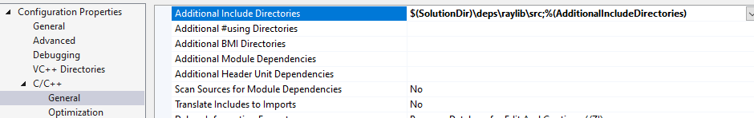

%{
summary: "Dead easy VS2022 project setup with raylib as a submodule"
}
---

How to create an empty Visual Studio project with raylib ready to use without having to use templates, CMake or other complex steps?

- Create a new Visual Studio project choose Empty C++ Project.
- Go to the project folder and create a new subfolder called "deps" (or any other name as you prefer for a folder to store external dependencies).

## Get from GitHub
- If you want, you can skip this article and get the ready to use Visual Studio template from my [GitHub](https://github.com/alfredbaudisch/EasyRaylibVS).

## Downloading raylib
- We now have to download raylib. You have two options: as a Git submodule or by downloading it from the website directly.

### raylib as a Git submodule
- Either with the Terminal or a Git GUI Client and initialize it as a Git repository: `git init`.
- Add raylib as a submodule of your project: `git submodule add https://github.com/raysan5/raylib deps/raylib`

### raylib from a zip
- Go to the raylib repository: https://github.com/raysan5/raylib
- Click "Code" then "Download ZIP"
- Extract the zip contents inside the "deps" folder. Make sure raylib is inside the "raylib" folder. So, "yourproject/deps/raylib".


## Continue Visual Studio Setup
- Open the Visual Studio solution.
- Right click the Solution name in the Solution Explorer and add the raylib's Visual Studio project from the deps folder into your solution:


- Create a new empty C file into your project. Don't worry about the name or contents, it's just to enable Visual Studio's "C/C++" project properties. 


- Right-click your project, "Properties".
- Go to "C/C++" and in "Additional Include Directories", add: `$(SolutionDir)\deps\raylib\src`
- Go to "Linker -> General" and in "Additional Library Directories", add: `$(SolutionDir)\build\raylib\bin\$(Platform)\$(Configuration)\`
- Go to "Linker -> Input", and in "Additional Dependencies", add: 
```
raylib.lib;opengl32.lib;kernel32.lib;user32.lib;gdi32.lib;winmm.lib;winspool.lib;comdlg32.lib;advapi32.lib;shell32.lib;ole32.lib;oleaut32.lib;uuid.lib;odbc32.lib;odbccp32.lib;%(AdditionalDependencies)
```




- Go to "C/C++ -> Code Generation" and in "Runtime Library" select "Multi-threaded (/MT)". Do this step for the "raylib" project too.
	- The reasoning for this one is that if you leave it as the default "Multi-threaded DLL (/MD)", when distributing your executable you are also going to have to distribute the "Visual C++ Redistributable for Visual Studio 2015", otherwise if the user machine doesn't have it installed they are going to see the error *"The code execution cannot proceed because VCRUNTIME140.dll was not found"*. See [this thread](https://www.reddit.com/r/raylib/comments/12xhtyy/distributing_a_raylib_executable_to_a_fresh/) for more.


- Right-click the "raylib" project and Build it.


And that's it!

## Example Code
In order to test that everything is working, let's test a quick Hello World. Paste this inside the C file you created previously and then press F5 to build and run.

```c
#include "raylib.h"

int main(void) {
    SetTargetFPS(60);
    InitWindow(1280, 720, "Hello raylib!");

    while (!WindowShouldClose()) {
        BeginDrawing();
        ClearBackground(BLACK);

        DrawText("Hello World!", 40, 40, 48, WHITE);

        EndDrawing();
    }

    CloseWindow();
}
```